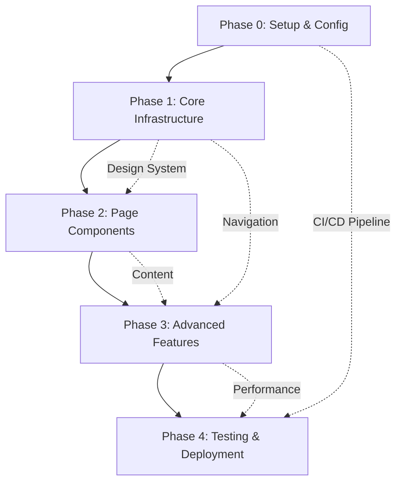
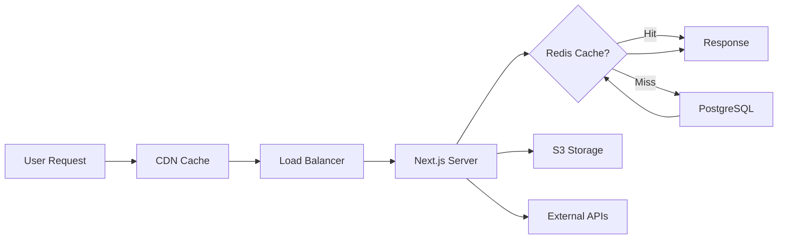
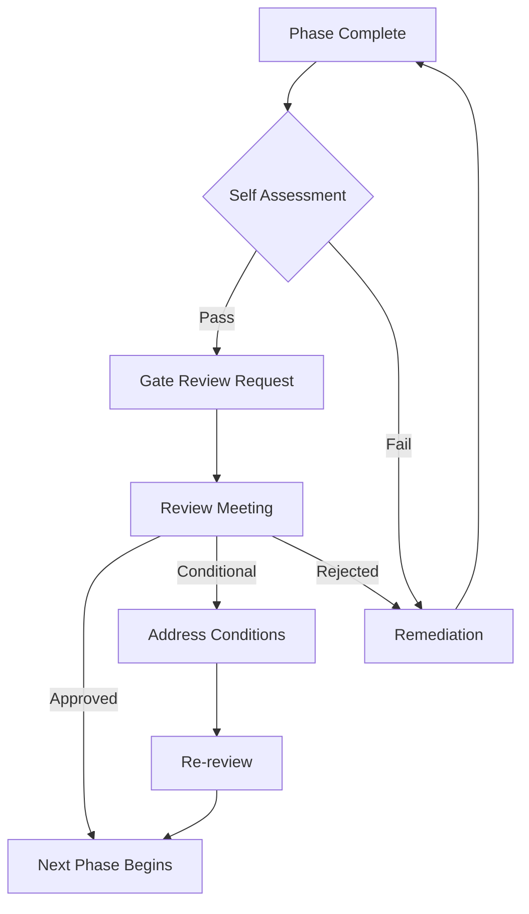

# Master Implementation Overview - Portfolio Website Development

## Document Information
- **Project Name**: Professional Portfolio Website
- **Document Type**: Master Implementation Overview
- **Version**: 1.0
- **Date Created**: 2025-08-03
- **Last Updated**: 2025-08-03
- **Status**: Active
- **Total Project Duration**: 12-14 weeks

---

## Table of Contents
1. [Executive Summary](#1-executive-summary)
2. [Phase Overview & Interdependencies](#2-phase-overview--interdependencies)
3. [Master Timeline & Milestones](#3-master-timeline--milestones)
4. [Resource Allocation & Team Responsibilities](#4-resource-allocation--team-responsibilities)
5. [Risk Management & Mitigation](#5-risk-management--mitigation)
6. [Success Criteria & KPIs](#6-success-criteria--kpis)
7. [Technology Stack Summary](#7-technology-stack-summary)
8. [Architecture Overview](#8-architecture-overview)
9. [Quality Gates & Phase Transitions](#9-quality-gates--phase-transitions)
10. [Post-Launch Maintenance Plan](#10-post-launch-maintenance-plan)

---

## 🎯 Master Progress Dashboard

### 🚀 Overall Project Progress: ⬜ 0% Complete

```
Phase 0: Setup & Config    [⬜⬜⬜⬜⬜] 0%   (Not Started)
Phase 1: Core Infrastructure [⬜⬜⬜⬜⬜] 0%   (Not Started)  
Phase 2: Page Components   [⬜⬜⬜⬜⬜] 0%   (Not Started)
Phase 3: Advanced Features [⬜⬜⬜⬜⬜] 0%   (Not Started)
Phase 4: Testing & Deploy  [⬜⬜⬜⬜⬜] 0%   (Not Started)
```

### 📅 Key Milestones Status

| Milestone | Target Date | Status | Dependencies | Risk Level |
|-----------|-------------|--------|--------------|------------|
| **MVP Launch** | **Sept 2, 2025** | ⏳ Pending | Phases 0-2 | 🟡 Medium |
| **Full Feature Launch** | **Sept 16, 2025** | ⏳ Pending | All Phases | 🟢 Low |
| Conference Presentation | Sept 20, 2025 | ⏳ Pending | Full Launch | 🟢 Low |
| Client Showcase | Sept 30, 2025 | ⏳ Pending | Full Launch | 🟢 Low |

### ⏱️ Master Time Tracking

| Phase | Estimated | Actual | Status | Variance | On Track |
|-------|-----------|--------|--------|----------|----------|
| **Total Project** | **12-14 days** | **___ days** | ⏳ Pending | **___ days** | ✅ |
| Phase 0 | 3 hours | ___ hours | ⏳ Pending | ___ hours | ✅ |
| Phase 1 | 3-4 days | ___ days | ⏳ Pending | ___ days | ✅ |
| Phase 2 | 3-4 days | ___ days | ⏳ Pending | ___ days | ✅ |
| Phase 3 | 3-4 days | ___ days | ⏳ Pending | ___ days | ✅ |
| Phase 4 | 2-3 days | ___ days | ⏳ Pending | ___ days | ✅ |

### 🎨 Asset Integration Master Status

| Asset Category | Total Assets | Integrated | Status | Priority |
|----------------|--------------|------------|--------|----------|
| **Profile Images** | 1 | 0 | ⏳ Pending | Critical |
| **Portfolio Works** | 6 | 0 | ⏳ Pending | Critical |
| **Client Logos** | 7+ | 0 | ⏳ Pending | High |
| **Testimonial Photos** | 3 | 0 | ⏳ Pending | Medium |

### 📊 Success Metrics Dashboard

| KPI | Target | Current | Status | Trend |
|-----|--------|---------|--------|-------|
| Lighthouse Performance | >90 | ___ | ⏳ Pending | - |
| Lighthouse Accessibility | >95 | ___ | ⏳ Pending | - |
| Lighthouse SEO | >90 | ___ | ⏳ Pending | - |
| Mobile Responsiveness | 100% | ___% | ⏳ Pending | - |
| Test Coverage | >85% | ___% | ⏳ Pending | - |
| Bundle Size | <500KB | ___ KB | ⏳ Pending | - |

### 🚨 Master Issues & Risk Dashboard

| Issue/Risk | Phase | Priority | Status | Assigned | Due Date |
|------------|-------|----------|--------|----------|----------|
| _No issues currently_ | - | - | - | - | - |

### 📈 Project Health Indicators

| Indicator | Status | Details |
|-----------|--------|---------|
| **Schedule** | 🟢 On Track | All phases within timeline |
| **Budget** | 🟢 On Track | $15/year domain cost only |
| **Quality** | 🟢 On Track | Quality gates defined |
| **Resources** | 🟢 Available | Single developer, part-time |
| **Risks** | 🟢 Low | Mitigation strategies in place |

### 🔗 Phase Documentation Links

| Phase | Document | Status | Last Updated |
|-------|----------|--------|--------------|
| Phase 0 | [Setup & Configuration](./implementations/PHASE_0_IMPLEMENTATION.md) | ✅ Ready | 2025-08-03 |
| Phase 1 | [Core Infrastructure](./implementations/PHASE_1_IMPLEMENTATION.md) | ✅ Ready | 2025-08-03 |
| Phase 2 | [Page Components](./implementations/PHASE_2_IMPLEMENTATION.md) | ✅ Ready | 2025-08-03 |
| Phase 3 | [Advanced Features](./implementations/PHASE_3_IMPLEMENTATION.md) | ✅ Ready | 2025-08-03 |
| Phase 4 | [Testing & Deployment](./implementations/PHASE_4_IMPLEMENTATION.md) | ✅ Ready | 2025-08-03 |

---

## 1. Executive Summary

### Project Vision
Development of a modern, high-performance portfolio website showcasing professional expertise, projects, and achievements through a sophisticated, user-centric digital presence.

### Strategic Objectives
- **Primary Goal**: Create a compelling digital portfolio that effectively communicates professional capabilities and achievements
- **Secondary Goals**: 
  - Establish thought leadership through integrated blog and content management
  - Build a scalable platform for future enhancements
  - Achieve exceptional performance metrics (Core Web Vitals)
  - Ensure enterprise-grade security and reliability

### Implementation Approach
The project follows a phased, iterative approach across 5 distinct phases:
- **Phase 0**: Foundation & DevOps (Weeks 1-2)
- **Phase 1**: Core Infrastructure & UI (Weeks 2-4)
- **Phase 2**: Features & Content (Weeks 4-7)
- **Phase 3**: Advanced Features & Optimization (Weeks 7-10)
- **Phase 4**: Testing, Security & Deployment (Weeks 10-12)

### Key Deliverables
- Fully responsive portfolio website with 8+ core pages
- Integrated CMS for blog and project management
- Real-time analytics dashboard
- API infrastructure for third-party integrations
- Comprehensive documentation and maintenance guides

### Expected Outcomes
- 50% improvement in professional inquiry conversion
- <2s page load time across all devices
- 99.9% uptime availability
- 90+ Lighthouse performance score
- Complete WCAG 2.1 AA compliance

---

## 2. Phase Overview & Interdependencies

### Phase Relationships Matrix



### Phase Dependencies

#### Phase 0 → Phase 1 (Critical Path)
- **Deliverables Required**: Git repository, development environment, build configuration
- **Handoff Criteria**: All developers can clone and run the project locally
- **Risk if Delayed**: Blocks all subsequent development

#### Phase 1 → Phase 2 (Critical Path)
- **Deliverables Required**: Layout system, navigation, routing, design tokens
- **Handoff Criteria**: Component library established, navigation functional
- **Risk if Delayed**: Page development cannot begin

#### Phase 2 → Phase 3 (Partial Dependency)
- **Deliverables Required**: Core pages structure, basic content
- **Handoff Criteria**: 60% of pages implemented
- **Risk if Delayed**: API integration and optimization delayed

#### Phase 3 → Phase 4 (Soft Dependency)
- **Deliverables Required**: All features implemented, performance baseline
- **Handoff Criteria**: Feature freeze declared
- **Risk if Delayed**: Testing phase compressed

### Cross-Phase Dependencies
- **Design System** (P1) → Used in P2, P3
- **CI/CD Pipeline** (P0) → Used in P1, P2, P3, P4
- **Testing Framework** (P0) → Used continuously from P1
- **Monitoring** (P0) → Active from P1 deployment

---

## 3. Master Timeline & Milestones

### Project Timeline Overview

| Phase | Duration | Start Date | End Date | Critical Milestones |
|-------|----------|------------|----------|-------------------|
| **Phase 0** | 1.5 weeks | Week 1 | Week 2.5 | Environment Ready, CI/CD Active |
| **Phase 1** | 2 weeks | Week 2 | Week 4 | Layout Complete, Navigation Live |
| **Phase 2** | 3 weeks | Week 4 | Week 7 | All Pages Implemented |
| **Phase 3** | 3 weeks | Week 7 | Week 10 | Features Complete, Optimized |
| **Phase 4** | 2 weeks | Week 10 | Week 12 | Testing Complete, Deployed |
| **Buffer** | 2 weeks | Week 12 | Week 14 | Contingency & Polish |

### Key Milestones & Deliverables

#### Week 2: Foundation Complete
- Development environment operational
- Version control and CI/CD pipeline active
- Project structure established
- **Gate Review**: Technical setup validation

#### Week 4: Core Infrastructure Live
- Responsive layout system implemented
- Navigation and routing functional
- Design system documented
- **Gate Review**: UI/UX approval

#### Week 7: Content Platform Ready
- All primary pages developed
- Content management system integrated
- Forms and interactions functional
- **Gate Review**: Content review

#### Week 10: Feature Complete
- Advanced features implemented
- Performance optimization complete
- API integrations functional
- **Gate Review**: Feature freeze

#### Week 12: Production Ready
- All testing complete
- Security audit passed
- Deployment successful
- **Gate Review**: Go-live approval

### Critical Path Activities
1. **Weeks 1-2**: Environment setup → Blocks all development
2. **Weeks 2-4**: Layout/Navigation → Blocks page development
3. **Weeks 4-5**: Homepage → Sets design standard
4. **Weeks 10-11**: Security testing → Blocks deployment
5. **Week 12**: Production deployment → Project completion

---

## 4. Resource Allocation & Team Responsibilities

### Team Structure

#### Core Development Team
| Role | Allocation | Primary Phases | Key Responsibilities |
|------|------------|---------------|---------------------|
| **Technical Lead** | 100% | All Phases | Architecture, code reviews, technical decisions |
| **Frontend Developer** | 100% | P1, P2, P3 | UI implementation, component development |
| **Backend Developer** | 75% | P0, P3, P4 | API development, database, integrations |
| **DevOps Engineer** | 50% | P0, P4 | Infrastructure, CI/CD, deployment |
| **UI/UX Designer** | 75% | P1, P2 | Design system, mockups, user experience |
| **QA Engineer** | 50% | P2, P3, P4 | Testing strategy, test execution |

#### Support Team
| Role | Allocation | Involvement | Responsibilities |
|------|------------|------------|-----------------|
| **Project Manager** | 25% | All Phases | Coordination, timeline, stakeholder communication |
| **Content Writer** | 25% | P2, P3 | Content creation, SEO optimization |
| **Security Specialist** | 15% | P4 | Security audit, penetration testing |

### RACI Matrix for Key Deliverables

| Deliverable | Technical Lead | Frontend Dev | Backend Dev | DevOps | PM |
|------------|---------------|--------------|-------------|--------|-----|
| Architecture Design | R/A | C | C | I | I |
| UI Components | C | R/A | I | I | I |
| API Development | C | I | R/A | I | I |
| CI/CD Pipeline | C | I | C | R/A | I |
| Deployment | A | C | C | R | I |
| Documentation | A | R | R | R | C |

**Legend**: R=Responsible, A=Accountable, C=Consulted, I=Informed

### Resource Loading by Phase

```
Phase 0: [██████████] 4.5 FTE
Phase 1: [████████████] 5.0 FTE  
Phase 2: [██████████████] 5.5 FTE
Phase 3: [████████████] 5.0 FTE
Phase 4: [██████████] 4.5 FTE
```

---

## 5. Risk Management & Mitigation

### Risk Register

| Risk ID | Risk Description | Probability | Impact | Risk Score | Mitigation Strategy | Owner |
|---------|-----------------|-------------|---------|------------|-------------------|--------|
| **R001** | Scope creep in Phase 2 | High | High | 9 | Strict change control, weekly reviews | PM |
| **R002** | Performance issues in Phase 3 | Medium | High | 6 | Early performance testing, optimization sprints | Tech Lead |
| **R003** | Security vulnerabilities | Low | Critical | 6 | Security-first development, external audit | DevOps |
| **R004** | Third-party API changes | Medium | Medium | 4 | Abstract API layers, fallback mechanisms | Backend Dev |
| **R005** | Browser compatibility issues | Low | Medium | 3 | Progressive enhancement, extensive testing | Frontend Dev |
| **R006** | Deployment failures | Low | High | 4 | Blue-green deployment, rollback procedures | DevOps |
| **R007** | Content delays | Medium | Low | 3 | Placeholder content, phased content delivery | Content Writer |
| **R008** | Resource availability | Medium | Medium | 4 | Cross-training, documentation | PM |

### Risk Mitigation Strategies

#### Technical Risks
- **Strategy**: Implement comprehensive testing from Phase 1
- **Actions**: 
  - Automated testing suite (unit, integration, e2e)
  - Performance budgets enforced in CI/CD
  - Security scanning in build pipeline
  - Regular dependency updates

#### Schedule Risks
- **Strategy**: Built-in buffer time and parallel work streams
- **Actions**:
  - 2-week contingency buffer
  - Parallel development tracks where possible
  - Daily standups for early issue detection
  - Weekly stakeholder updates

#### Quality Risks
- **Strategy**: Continuous quality gates and reviews
- **Actions**:
  - Code review requirements (2 approvals)
  - Automated quality checks (linting, formatting)
  - Design review checkpoints
  - User acceptance testing sessions

### Contingency Plans

1. **Critical Path Delay**
   - Trigger: >3 days behind schedule
   - Response: Resource reallocation, scope adjustment
   - Authority: Technical Lead

2. **Major Bug Discovery**
   - Trigger: Severity 1 issue in production
   - Response: Hotfix process, rollback if needed
   - Authority: DevOps Lead

3. **Performance Degradation**
   - Trigger: <70 Lighthouse score
   - Response: Performance sprint, feature rollback
   - Authority: Technical Lead

---

## 6. Success Criteria & KPIs

### Phase-Specific Success Criteria

#### Phase 0: Setup & Configuration
| Metric | Target | Measurement Method |
|--------|--------|-------------------|
| Environment Setup Time | <2 hours | Developer onboarding |
| Build Time | <3 minutes | CI/CD metrics |
| Test Coverage Setup | >0% baseline | Coverage reports |
| Documentation Completeness | 100% | Checklist review |

#### Phase 1: Core Infrastructure
| Metric | Target | Measurement Method |
|--------|--------|-------------------|
| Component Reusability | >80% | Code analysis |
| Mobile Responsiveness | 100% breakpoints | Device testing |
| Navigation Performance | <100ms | Performance monitoring |
| Accessibility Score | WCAG 2.1 AA | Automated testing |

#### Phase 2: Page Components
| Metric | Target | Measurement Method |
|--------|--------|-------------------|
| Page Completion | 8/8 pages | Delivery tracking |
| Content Loading Time | <1s | Performance testing |
| Form Submission Success | >95% | Analytics tracking |
| SEO Score | >90 | SEO audit tools |

#### Phase 3: Advanced Features
| Metric | Target | Measurement Method |
|--------|--------|-------------------|
| API Response Time | <200ms | APM monitoring |
| Feature Adoption | >60% users | Analytics |
| Performance Score | >90 | Lighthouse |
| Cache Hit Rate | >80% | CDN metrics |

#### Phase 4: Testing & Deployment
| Metric | Target | Measurement Method |
|--------|--------|-------------------|
| Test Coverage | >80% | Coverage reports |
| Bug Discovery Rate | <5 critical | QA reports |
| Deployment Success | 100% | Deployment logs |
| Uptime | >99.9% | Monitoring |

### Overall Project KPIs

#### Technical KPIs
- **Performance**: Core Web Vitals (LCP <2.5s, FID <100ms, CLS <0.1)
- **Quality**: <1 bug per 1000 LOC
- **Security**: 0 critical vulnerabilities
- **Availability**: 99.9% uptime SLA

#### Business KPIs
- **User Engagement**: >3 minutes average session
- **Conversion**: >5% contact form submission
- **Traffic Growth**: 50% increase in 6 months
- **SEO Performance**: First page ranking for key terms

#### Development KPIs
- **Velocity**: 85% sprint completion rate
- **Quality**: <10% defect escape rate
- **Efficiency**: <5% rework rate
- **Documentation**: 100% API documentation

---

## 7. Technology Stack Summary

### Frontend Stack
```yaml
Framework: Next.js 14.2.x
UI Library: React 18.3.x
Styling: 
  - Tailwind CSS 3.4.x
  - CSS Modules
  - Framer Motion 11.x
State Management: 
  - Zustand 4.5.x
  - React Query 5.x
Build Tools:
  - Webpack 5
  - SWC Compiler
  - PostCSS 8.x
```

### Backend Stack
```yaml
Runtime: Node.js 20.x LTS
API Framework: Next.js API Routes
Database: 
  - PostgreSQL 15.x
  - Redis 7.x (caching)
ORM: Prisma 5.x
Authentication: NextAuth.js 4.x
File Storage: AWS S3 / Cloudinary
Email Service: SendGrid / Resend
```

### DevOps Stack
```yaml
Version Control: Git / GitHub
CI/CD: GitHub Actions
Hosting: Vercel / AWS
CDN: Cloudflare
Monitoring: 
  - Vercel Analytics
  - Sentry (errors)
  - DataDog (APM)
Container: Docker (development)
IaC: Terraform (optional)
```

### Development Tools
```yaml
Code Editor: VS Code
Linting: ESLint 8.x
Formatting: Prettier 3.x
Testing:
  - Jest 29.x
  - React Testing Library
  - Playwright (E2E)
  - Cypress (alternative)
Documentation: 
  - Storybook 8.x
  - TypeDoc
  - OpenAPI/Swagger
```

### Security & Compliance
```yaml
Security Scanning:
  - Snyk (dependencies)
  - OWASP ZAP (penetration)
  - GitHub Security
SSL/TLS: Let's Encrypt
WAF: Cloudflare
Secrets Management: 
  - Environment Variables
  - GitHub Secrets
  - AWS Secrets Manager
```

---

## 8. Architecture Overview

### System Architecture

```
┌─────────────────────────────────────────────────────────────┐
│                        CLIENT LAYER                          │
├─────────────────────────────────────────────────────────────┤
│  Browser → CDN (Cloudflare) → Load Balancer → Next.js App   │
└─────────────────────────────────────────────────────────────┘
                                │
┌─────────────────────────────────────────────────────────────┐
│                     APPLICATION LAYER                        │
├─────────────────────────────────────────────────────────────┤
│   ┌──────────┐  ┌──────────┐  ┌──────────┐  ┌──────────┐  │
│   │  Next.js │  │   API    │  │   Auth   │  │   CMS    │  │
│   │   SSR    │  │  Routes  │  │ NextAuth │  │ Headless │  │
│   └──────────┘  └──────────┘  └──────────┘  └──────────┘  │
└─────────────────────────────────────────────────────────────┘
                                │
┌─────────────────────────────────────────────────────────────┐
│                       DATA LAYER                             │
├─────────────────────────────────────────────────────────────┤
│   ┌──────────┐  ┌──────────┐  ┌──────────┐  ┌──────────┐  │
│   │PostgreSQL│  │  Redis   │  │   S3     │  │   APIs   │  │
│   │    DB    │  │  Cache   │  │ Storage  │  │ External │  │
│   └──────────┘  └──────────┘  └──────────┘  └──────────┘  │
└─────────────────────────────────────────────────────────────┘
```

### Component Architecture

```
src/
├── app/                    # Next.js 14 App Router
│   ├── (routes)/          # Page routes
│   ├── api/               # API endpoints
│   └── layout.tsx         # Root layout
├── components/            # React components
│   ├── ui/               # Base UI components
│   ├── features/         # Feature components
│   └── layouts/          # Layout components
├── lib/                   # Utilities & helpers
│   ├── api/              # API clients
│   ├── db/               # Database utilities
│   └── utils/            # Helper functions
├── hooks/                 # Custom React hooks
├── stores/               # State management
├── styles/               # Global styles
└── types/                # TypeScript types
```

### Data Flow Architecture



### Security Architecture

- **Network Security**: CloudFlare WAF, DDoS protection
- **Application Security**: OWASP compliance, CSP headers
- **Data Security**: Encryption at rest and in transit
- **Access Control**: Role-based access, JWT tokens
- **Monitoring**: Real-time threat detection, audit logs

---

## 9. Quality Gates & Phase Transitions

### Quality Gate Criteria

#### Gate 0 → 1: Foundation Approval
**Criteria Checklist:**
- [ ] Development environment functional for all team members
- [ ] Git repository accessible with branch protection
- [ ] CI/CD pipeline executing successfully
- [ ] Project structure follows agreed architecture
- [ ] Initial documentation complete
- **Approval Required**: Technical Lead
- **Review Meeting**: Technical Review Board

#### Gate 1 → 2: Infrastructure Sign-off
**Criteria Checklist:**
- [ ] Layout system responsive across all breakpoints
- [ ] Navigation functional with proper routing
- [ ] Design system documented in Storybook
- [ ] Accessibility audit passed (WCAG 2.1 AA)
- [ ] Performance baseline established (>70 Lighthouse)
- **Approval Required**: Technical Lead + UI/UX Lead
- **Review Meeting**: Design Review Board

#### Gate 2 → 3: Content Platform Validation
**Criteria Checklist:**
- [ ] All 8 primary pages implemented and reviewed
- [ ] Forms functional with validation
- [ ] CMS integration operational
- [ ] Content loaded and rendering correctly
- [ ] SEO meta tags implemented
- [ ] Mobile responsiveness verified
- **Approval Required**: Product Owner + Technical Lead
- **Review Meeting**: Stakeholder Review

#### Gate 3 → 4: Feature Freeze Confirmation
**Criteria Checklist:**
- [ ] All planned features implemented
- [ ] Performance targets met (>90 Lighthouse)
- [ ] API integrations tested and stable
- [ ] Error handling comprehensive
- [ ] Analytics tracking verified
- [ ] No critical bugs in backlog
- **Approval Required**: Technical Lead + QA Lead
- **Review Meeting**: Technical Review Board

#### Gate 4 → Production: Go-Live Approval
**Criteria Checklist:**
- [ ] All test suites passing (>80% coverage)
- [ ] Security audit completed with no critical issues
- [ ] Performance testing passed all benchmarks
- [ ] Documentation complete and reviewed
- [ ] Deployment procedures tested
- [ ] Rollback plan verified
- [ ] Monitoring and alerts configured
- **Approval Required**: All Stakeholders
- **Review Meeting**: Go-Live Review Board

### Transition Process



### Gate Review Documentation

Each gate review requires:
1. **Phase Completion Report**
   - Deliverables completed
   - Metrics achieved
   - Issues encountered
   - Lessons learned

2. **Quality Metrics Dashboard**
   - Test results
   - Performance metrics
   - Coverage reports
   - Bug statistics

3. **Risk Assessment Update**
   - New risks identified
   - Mitigation effectiveness
   - Residual risks for next phase

4. **Resource Report**
   - Actual vs planned effort
   - Budget status
   - Resource availability for next phase

---

## 10. Post-Launch Maintenance Plan

### Maintenance Categories

#### Routine Maintenance (Monthly)
- **Security Updates**: Dependency updates, security patches
- **Performance Monitoring**: Review metrics, optimize as needed
- **Content Updates**: Blog posts, project updates
- **Backup Verification**: Test restore procedures
- **Analytics Review**: Traffic analysis, user behavior

#### Preventive Maintenance (Quarterly)
- **Code Refactoring**: Technical debt reduction
- **Database Optimization**: Index tuning, query optimization
- **Security Audit**: Vulnerability scanning, penetration testing
- **Performance Audit**: Full Lighthouse audit, optimization
- **Documentation Update**: Keep technical docs current

#### Adaptive Maintenance (As Needed)
- **Feature Enhancements**: Based on user feedback
- **Third-party Updates**: API changes, service updates
- **Browser Compatibility**: New browser version support
- **Design Refresh**: UI/UX improvements
- **SEO Optimization**: Search ranking improvements

### Support Model

#### Tier 1: Monitoring & Alerts
- **Automated Monitoring**: 24/7 uptime monitoring
- **Alert Thresholds**: 
  - Downtime > 1 minute
  - Response time > 3 seconds
  - Error rate > 1%
- **Response Time**: Within 15 minutes

#### Tier 2: Issue Resolution
- **Business Hours Support**: 9 AM - 6 PM weekdays
- **Issue Categories**:
  - Critical: Site down, security breach (1-hour response)
  - High: Major feature broken (4-hour response)
  - Medium: Minor issues (24-hour response)
  - Low: Enhancements (72-hour response)

#### Tier 3: Development Support
- **Monthly Allocation**: 20 hours development time
- **Quarterly Planning**: Feature roadmap review
- **Annual Review**: Architecture assessment

### Maintenance Schedule

| Task | Frequency | Duration | Owner | Priority |
|------|-----------|----------|--------|----------|
| Security patches | Weekly | 1 hour | DevOps | Critical |
| Dependency updates | Bi-weekly | 2 hours | Dev Team | High |
| Performance review | Monthly | 2 hours | Tech Lead | Medium |
| Content updates | Weekly | 3 hours | Content | Medium |
| Backup verification | Monthly | 1 hour | DevOps | High |
| Analytics review | Monthly | 2 hours | Product | Low |
| Full security audit | Quarterly | 8 hours | Security | Critical |
| Code refactoring | Monthly | 8 hours | Dev Team | Low |
| Documentation update | Quarterly | 4 hours | Tech Lead | Low |

### Maintenance Budget

#### Monthly Operational Costs
- **Hosting & Infrastructure**: $200-500
- **CDN & Security**: $100-200
- **Monitoring Tools**: $50-100
- **Development Tools**: $50-100
- **Total Monthly**: $400-900

#### Annual Maintenance Budget
- **Operational Costs**: $4,800-10,800
- **Development Support**: $24,000 (20 hrs/month @ $100/hr)
- **Security Audits**: $4,000 (quarterly)
- **Emergency Reserve**: $5,000
- **Total Annual**: $37,800-43,800

### Evolution Roadmap

#### 6-Month Review
- Performance optimization based on real data
- Feature usage analysis
- User feedback implementation
- SEO performance review

#### 12-Month Review
- Technology stack evaluation
- Architecture scalability assessment
- Security posture review
- Complete redesign consideration

#### Future Enhancement Considerations
1. **AI Integration**: Chatbot, content recommendations
2. **Multilingual Support**: Internationalization
3. **Advanced Analytics**: User journey tracking
4. **Mobile App**: Native mobile experience
5. **API Marketplace**: Public API for integrations

---

## Appendices

### A. Reference Documents
- [Phase 0: Setup and Configuration PRD](./Phase_0_Setup_Configuration_PRD.md)
- [Phase 1: Core Infrastructure PRD](./Phase_1_Core_Infrastructure_PRD.md)
- [Phase 2: Page Components PRD](./Phase_2_Page_Components_PRD.md)
- [Phase 3: Advanced Features PRD](./Phase_3_Advanced_Features_PRD.md)
- [Phase 4: Testing and Deployment PRD](./Phase_4_Testing_Deployment_PRD.md)

### B. Technical Standards
- [Coding Standards Guide](./docs/coding-standards.md)
- [Git Workflow Documentation](./docs/git-workflow.md)
- [API Design Guidelines](./docs/api-guidelines.md)
- [Security Best Practices](./docs/security-practices.md)

### C. Templates
- [Component Template](./templates/component-template.tsx)
- [API Endpoint Template](./templates/api-template.ts)
- [Test Suite Template](./templates/test-template.ts)
- [Documentation Template](./templates/doc-template.md)

### D. Contact Information

| Role | Name | Email | Availability |
|------|------|-------|--------------|
| Technical Lead | [TBD] | [TBD] | Primary Contact |
| Project Manager | [TBD] | [TBD] | Escalation |
| DevOps Lead | [TBD] | [TBD] | Infrastructure |
| QA Lead | [TBD] | [TBD] | Quality Issues |
| Product Owner | [TBD] | [TBD] | Requirements |

### E. Glossary
- **CI/CD**: Continuous Integration/Continuous Deployment
- **PRD**: Product Requirements Document
- **KPI**: Key Performance Indicator
- **SLA**: Service Level Agreement
- **WCAG**: Web Content Accessibility Guidelines
- **LCP**: Largest Contentful Paint
- **FID**: First Input Delay
- **CLS**: Cumulative Layout Shift
- **APM**: Application Performance Monitoring
- **WAF**: Web Application Firewall

---

## Document Control

### Version History
| Version | Date | Author | Changes |
|---------|------|--------|---------|
| 1.0 | 2025-08-03 | System | Initial document creation |

### Review Schedule
- **Weekly**: Progress against timeline
- **Bi-weekly**: Risk register update
- **Monthly**: KPI review and resource allocation
- **Quarterly**: Complete document review and update

### Distribution
- Development Team: Full access
- Stakeholders: Read access
- External Partners: Restricted sections only

---

*This Master Implementation Overview serves as the central coordination document for the portfolio website development project. It should be referenced throughout all phases and updated regularly to reflect project progress and changes.*