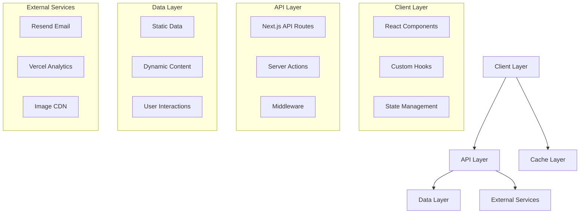

# Phase 3 Implementation Guide - Advanced Features and Data Management
**Albert Nartey Portfolio Website**

## Document Information

- **Project Name**: Albert Nartey Portfolio - Phase 3 Advanced Features
- **Document Version**: 1.0
- **Date**: 2025-08-03
- **Author**: Data Engineering Specialist
- **Status**: Ready for Implementation
- **Prerequisites**: Phase 0, Phase 1, and Phase 2 completed successfully

---

## 📊 Progress Tracker

### Overall Phase 3 Progress: ⬜ 0% Complete

```
Data Architecture  [⬜⬜⬜⬜⬜] 0%  (0/10 tasks completed)
Performance Opt    [⬜⬜⬜⬜⬜] 0%  (0/12 tasks completed)
Advanced Features  [⬜⬜⬜⬜⬜] 0%  (0/15 tasks completed)
API Development    [⬜⬜⬜⬜⬜] 0%  (0/8 tasks completed)
Analytics Setup    [⬜⬜⬜⬜⬜] 0%  (0/6 tasks completed)
Security & Testing [⬜⬜⬜⬜⬜] 0%  (0/10 tasks completed)
```

### 🎯 Phase 3 Milestones

| Feature Area | Target Date | Status | Completion | Dependencies |
|--------------|-------------|--------|------------|--------------|
| Data Architecture | Week 3 | ⏳ Pending | 0% | Phase 2 complete |
| Performance Optimization | Week 3 | ⏳ Pending | 0% | Data Architecture |
| Advanced Features | Week 4 | ⏳ Pending | 0% | Performance Opt |
| API & Analytics | Week 4 | ⏳ Pending | 0% | Advanced Features |
| Security Hardening | Week 4 | ⏳ Pending | 0% | All above |

### ⏱️ Time Tracking

| Component | Estimated | Actual | Status | Priority |
|-----------|-----------|--------|--------|----------|
| **Total Phase 3** | **3-4 days** | **___ days** | ⏳ Pending | **High** |
| Data Architecture | 8 hours | ___ hours | ⏳ Pending | Critical |
| Performance Optimization | 10 hours | ___ hours | ⏳ Pending | Critical |
| Advanced Features | 12 hours | ___ hours | ⏳ Pending | High |
| API Development | 6 hours | ___ hours | ⏳ Pending | High |
| Analytics Integration | 4 hours | ___ hours | ⏳ Pending | Medium |
| Security & Testing | 8 hours | ___ hours | ⏳ Pending | High |

### 🚨 Issues & Blockers

| Issue | Priority | Status | Area | Resolution |
|-------|----------|--------|------|------------|
| _No issues currently_ | - | - | - | - |

### 📊 Performance Targets

| Metric | Target | Current | Status | Notes |
|--------|--------|---------|--------|-------|
| Lighthouse Score | >90 | ___ | ⏳ Pending | All categories |
| Bundle Size | <500KB | ___ KB | ⏳ Pending | Gzipped |
| LCP | <2.5s | ___s | ⏳ Pending | Largest Contentful Paint |
| FID | <100ms | ___ms | ⏳ Pending | First Input Delay |
| CLS | <0.1 | ___ | ⏳ Pending | Cumulative Layout Shift |

### 🔧 Feature Implementation Status

#### 📈 Performance Optimization (0/12 tasks)
- [ ] **[2h]** Image optimization pipeline setup *(Critical)*
- [ ] **[1h]** Lazy loading implementation *(Critical)*
- [ ] **[2h]** Code splitting strategies *(High)*
- [ ] **[1h]** Bundle size analysis and optimization *(High)*
- [ ] **[1h]** Caching mechanisms implementation *(High)*
- [ ] **[1h]** Font optimization and preloading *(Medium)*
- [ ] **[30min]** CSS optimization and minification *(Medium)*
- [ ] **[30min]** JavaScript tree shaking *(Medium)*
- [ ] **[1h]** Service worker implementation *(Medium)*
- [ ] **[30min]** Critical CSS inlining *(Low)*
- [ ] **[30min]** Resource hints optimization *(Low)*
- [ ] **[30min]** Performance monitoring setup *(Medium)*

#### 🚀 Advanced Features (0/15 tasks)
- [ ] **[2h]** Real-time form validation with Zod *(Critical)*
- [ ] **[3h]** Email integration with Resend API *(Critical)*
- [ ] **[2h]** Contact form submission handling *(Critical)*
- [ ] **[2h]** Search functionality implementation *(High)*
- [ ] **[1h]** Dark/light mode persistence *(High)*
- [ ] **[1h]** SEO meta tags dynamic generation *(High)*
- [ ] **[1h]** Sitemap auto-generation *(Medium)*
- [ ] **[1h]** RSS feed for projects *(Medium)*
- [ ] **[30min]** Social media sharing integration *(Medium)*
- [ ] **[30min]** Print stylesheet optimization *(Low)*
- [ ] **[1h]** PWA capabilities implementation *(Medium)*
- [ ] **[30min]** Offline functionality *(Low)*
- [ ] **[1h]** Error boundary implementation *(High)*
- [ ] **[30min]** Loading states optimization *(Medium)*
- [ ] **[30min]** Animation performance optimization *(Medium)*

---

## Table of Contents

1. [Overview and Objectives](#1-overview-and-objectives)
2. [Data Architecture Design](#2-data-architecture-design)
3. [Performance Optimization Pipeline](#3-performance-optimization-pipeline)
4. [Advanced Features Implementation](#4-advanced-features-implementation)
5. [Data Models and Types](#5-data-models-and-types)
6. [API Endpoints Implementation](#6-api-endpoints-implementation)
7. [Real-time Features](#7-real-time-features)
8. [Analytics and Monitoring](#8-analytics-and-monitoring)
9. [Security and Validation](#9-security-and-validation)
10. [Testing and Quality Assurance](#10-testing-and-quality-assurance)

---

## 1. Overview and Objectives

### 1.1 Phase 3 Goals

**Primary Objectives:**
- Implement comprehensive data management system for portfolio content
- Create performance-optimized pipeline for assets and content delivery
- Build advanced interactive features with real-time capabilities
- Establish analytics and monitoring infrastructure
- Implement SEO optimization with dynamic meta generation
- Create scalable content management architecture

**Key Deliverables:**
- Centralized data architecture with TypeScript models
- Advanced image optimization and lazy loading system
- Real-time form validation with email integration
- Analytics implementation with custom event tracking
- SEO optimization with dynamic sitemap and RSS feeds
- Performance monitoring and optimization tools
- Advanced features: theme switching, search functionality, content filtering

### 1.2 Technical Architecture Overview



---

## 2. Data Architecture Design

### 2.1 Data Storage Strategy

```typescript
// lib/data/types.ts
export interface DataSource {
  type: 'static' | 'dynamic' | 'external';
  source: string;
  cacheStrategy: 'memory' | 'disk' | 'cdn' | 'none';
  refreshInterval?: number;
}

export interface DataLayer {
  projects: DataSource;
  skills: DataSource;
  experience: DataSource;
  education: DataSource;
  testimonials: DataSource;
  blog: DataSource;
}
```

**Data Storage Architecture:**

1. **Static Content** (Build-time)
   - Projects metadata and descriptions
   - Skills and experience data
   - Education and certification information
   - Site configuration and constants

2. **Dynamic Content** (Runtime)
   - Contact form submissions
   - Analytics events
   - User preferences (theme, language)
   - Search queries and results

3. **External Data** (API integrations)
   - GitHub repositories
   - Social media feeds
   - Blog posts from CMS
   - Email service responses

### 2.2 Data Organization Structure

```
data/
├── static/
│   ├── projects.json
│   ├── skills.json
│   ├── experience.json
│   ├── education.json
│   └── testimonials.json
├── config/
│   ├── site.json
│   ├── navigation.json
│   └── social.json
├── schemas/
│   ├── project.schema.ts
│   ├── skill.schema.ts
│   └── contact.schema.ts
└── utils/
    ├── data-fetcher.ts
    ├── cache-manager.ts
    └── validator.ts
```

### 2.3 Data Fetching and Caching System

```typescript
// lib/data/data-fetcher.ts
import { cache } from 'react';
import { unstable_cache } from 'next/cache';

export class DataFetcher {
  private static instance: DataFetcher;
  private cache = new Map<string, any>();

  static getInstance(): DataFetcher {
    if (!DataFetcher.instance) {
      DataFetcher.instance = new DataFetcher();
    }
    return DataFetcher.instance;
  }

  // Server-side cached data fetching
  getProjects = unstable_cache(
    async () => {
      const projects = await import('@/data/static/projects.json');
      return projects.default;
    },
    ['projects'],
    {
      revalidate: 3600, // 1 hour
      tags: ['projects']
    }
  );

  getSkills = unstable_cache(
    async () => {
      const skills = await import('@/data/static/skills.json');
      return skills.default;
    },
    ['skills'],
    {
      revalidate: 3600,
      tags: ['skills']
    }
  );

  // Client-side cached data fetching
  async getProjectsClient(): Promise<Project[]> {
    const cacheKey = 'projects-client';
    
    if (this.cache.has(cacheKey)) {
      return this.cache.get(cacheKey);
    }

    const response = await fetch('/api/projects');
    const projects = await response.json();
    
    this.cache.set(cacheKey, projects);
    
    // Auto-expire cache after 5 minutes
    setTimeout(() => {
      this.cache.delete(cacheKey);
    }, 5 * 60 * 1000);

    return projects;
  }

  // Invalidate cache by tags
  async invalidateCache(tags: string[]) {
    const { revalidateTag } = await import('next/cache');
    tags.forEach(tag => revalidateTag(tag));
  }
}
```

---

## 3. Performance Optimization Pipeline

### 3.1 Image Optimization System

```typescript
// lib/optimization/image-optimizer.ts
import { ImageLoaderProps } from 'next/image';

export class ImageOptimizer {
  private static CDN_BASE = process.env.NEXT_PUBLIC_CDN_URL || '';

  static loader = ({ src, width, quality }: ImageLoaderProps): string => {
    if (src.startsWith('http')) {
      return src;
    }

    const params = new URLSearchParams({
      url: `${ImageOptimizer.CDN_BASE}${src}`,
      w: width.toString(),
      q: (quality || 75).toString(),
      fm: 'webp'
    });

    return `/_next/image?${params}`;
  };

  static getOptimizedSrc(src: string, options: {
    width?: number;
    height?: number;
    quality?: number;
    format?: 'webp' | 'avif' | 'jpg' | 'png';
  } = {}): string {
    const {
      width = 800,
      height,
      quality = 80,
      format = 'webp'
    } = options;

    if (src.startsWith('http')) {
      return src;
    }

    const params = new URLSearchParams({
      url: `${ImageOptimizer.CDN_BASE}${src}`,
      w: width.toString(),
      q: quality.toString(),
      fm: format
    });

    if (height) {
      params.set('h', height.toString());
      params.set('fit', 'crop');
    }

    return `/_next/image?${params}`;
  }

  static generateSrcSet(src: string, sizes: number[]): string {
    return sizes
      .map(size => `${this.getOptimizedSrc(src, { width: size })} ${size}w`)
      .join(', ');
  }
}

// components/ui/OptimizedImage.tsx
'use client';

import Image from 'next/image';
import { useState } from 'react';
import { cn } from '@/lib/utils';
import { ImageOptimizer } from '@/lib/optimization/image-optimizer';

interface OptimizedImageProps {
  src: string;
  alt: string;
  width?: number;
  height?: number;
  className?: string;
  priority?: boolean;
  placeholder?: 'blur' | 'empty';
  blurDataURL?: string;
  sizes?: string;
  quality?: number;
}

export const OptimizedImage: React.FC<OptimizedImageProps> = ({
  src,
  alt,
  width = 800,
  height = 600,
  className,
  priority = false,
  placeholder = 'blur',
  blurDataURL,
  sizes = '(max-width: 768px) 100vw, (max-width: 1200px) 50vw, 33vw',
  quality = 80
}) => {
  const [isLoading, setIsLoading] = useState(true);
  const [hasError, setHasError] = useState(false);

  const handleLoad = () => {
    setIsLoading(false);
  };

  const handleError = () => {
    setIsLoading(false);
    setHasError(true);
  };

  if (hasError) {
    return (
      <div className={cn(
        'bg-gray-200 dark:bg-gray-800 flex items-center justify-center',
        'text-gray-500 dark:text-gray-400',
        className
      )}>
        <span>Failed to load image</span>
      </div>
    );
  }

  return (
    <div className={cn('relative overflow-hidden', className)}>
      <Image
        src={src}
        alt={alt}
        width={width}
        height={height}
        priority={priority}
        placeholder={placeholder}
        blurDataURL={blurDataURL || 'data:image/jpeg;base64,/9j/4AAQSkZJRgABAQAAAQABAAD/2wBDAAYEBQYFBAYGBQYHBwYIChAKCgkJChQODwwQFxQYGBcUFhYaHSUfGhsjHBYWICwgIyYnKSopGR8tMC0oMCUoKSj/2wBDAQcHBwoIChMKChMoGhYaKCgoKCgoKCgoKCgoKCgoKCgoKCgoKCgoKCgoKCgoKCgoKCgoKCgoKCgoKCgoKCgoKCj/wAARCAABAAEDASIAAhEBAxEB/8QAFQABAQAAAAAAAAAAAAAAAAAAAAv/xAAhEAACAQMDBQAAAAAAAAAAAAABAgMABAUGIWGRkqGx0f/EABUBAQEAAAAAAAAAAAAAAAAAAAMF/8QAGhEAAgIDAAAAAAAAAAAAAAAAAAECEgMRkf/aAAwDAQACEQMRAD8AltJagyeH0AthI5xdrLcNM91BF5pX2HaH9bcfaSXWGaRmknyJckliyjqTzSlT54b6bk+h0R//2Q=='}
        sizes={sizes}
        quality={quality}
        loader={ImageOptimizer.loader}
        onLoad={handleLoad}
        onError={handleError}
        className={cn(
          'transition-opacity duration-300',
          isLoading ? 'opacity-0' : 'opacity-100'
        )}
      />
      {isLoading && (
        <div className="absolute inset-0 bg-gray-200 dark:bg-gray-800 animate-pulse" />
      )}
    </div>
  );
};
```

### 3.2 Lazy Loading Implementation

```typescript
// hooks/useLazyLoading.ts
'use client';

import { useEffect, useRef, useState, useCallback } from 'react';

interface UseLazyLoadingOptions {
  threshold?: number;
  rootMargin?: string;
  triggerOnce?: boolean;
}

export const useLazyLoading = (options: UseLazyLoadingOptions = {}) => {
  const {
    threshold = 0.1,
    rootMargin = '50px',
    triggerOnce = true
  } = options;

  const [isIntersecting, setIsIntersecting] = useState(false);
  const [hasTriggered, setHasTriggered] = useState(false);
  const elementRef = useRef<HTMLDivElement>(null);

  const resetTrigger = useCallback(() => {
    setHasTriggered(false);
    setIsIntersecting(false);
  }, []);

  useEffect(() => {
    const element = elementRef.current;
    if (!element) return;

    const observer = new IntersectionObserver(
      ([entry]) => {
        const isVisible = entry.isIntersecting;
        
        if (isVisible && (!hasTriggered || !triggerOnce)) {
          setIsIntersecting(true);
          setHasTriggered(true);
        } else if (!triggerOnce) {
          setIsIntersecting(isVisible);
        }
      },
      {
        threshold,
        rootMargin
      }
    );

    observer.observe(element);

    return () => {
      observer.unobserve(element);
    };
  }, [threshold, rootMargin, triggerOnce, hasTriggered]);

  return {
    elementRef,
    isIntersecting: triggerOnce ? hasTriggered : isIntersecting,
    resetTrigger
  };
};

// components/ui/LazySection.tsx
'use client';

import { motion, AnimatePresence } from 'framer-motion';
import { useLazyLoading } from '@/hooks/useLazyLoading';
import { cn } from '@/lib/utils';

interface LazySectionProps {
  children: React.ReactNode;
  className?: string;
  animation?: 'fade' | 'slideUp' | 'slideLeft' | 'scale';
  delay?: number;
  threshold?: number;
}

const animations = {
  fade: {
    initial: { opacity: 0 },
    animate: { opacity: 1 },
    exit: { opacity: 0 }
  },
  slideUp: {
    initial: { opacity: 0, y: 50 },
    animate: { opacity: 1, y: 0 },
    exit: { opacity: 0, y: 50 }
  },
  slideLeft: {
    initial: { opacity: 0, x: 50 },
    animate: { opacity: 1, x: 0 },
    exit: { opacity: 0, x: 50 }
  },
  scale: {
    initial: { opacity: 0, scale: 0.8 },
    animate: { opacity: 1, scale: 1 },
    exit: { opacity: 0, scale: 0.8 }
  }
};

export const LazySection: React.FC<LazySectionProps> = ({
  children,
  className,
  animation = 'slideUp',
  delay = 0,
  threshold = 0.1
}) => {
  const { elementRef, isIntersecting } = useLazyLoading({ threshold });

  return (
    <div ref={elementRef} className={cn('min-h-[50px]', className)}>
      <AnimatePresence>
        {isIntersecting && (
          <motion.div
            {...animations[animation]}
            transition={{
              duration: 0.6,
              delay,
              ease: [0.25, 0.46, 0.45, 0.94]
            }}
          >
            {children}
          </motion.div>
        )}
      </AnimatePresence>
    </div>
  );
};
```

### 3.3 Code Splitting Strategy

```typescript
// lib/optimization/code-splitting.ts
import dynamic from 'next/dynamic';
import { ComponentType } from 'react';

// Lazy load heavy components
export const LazyProjectGallery = dynamic(
  () => import('@/components/pages/Portfolio/ProjectGallery'),
  {
    loading: () => <div className="animate-pulse bg-gray-200 h-64 rounded-lg" />,
    ssr: false
  }
);

export const LazyContactForm = dynamic(
  () => import('@/components/forms/ContactForm'),
  {
    loading: () => <div className="animate-pulse bg-gray-200 h-96 rounded-lg" />
  }
);

export const LazySkillsChart = dynamic(
  () => import('@/components/charts/SkillsChart'),
  {
    loading: () => <div className="animate-pulse bg-gray-200 h-48 rounded-lg" />,
    ssr: false
  }
);

export const LazyAnimations = dynamic(
  () => import('@/components/animations/ParticleBackground'),
  {
    loading: () => null,
    ssr: false
  }
);

// Route-based code splitting
export const routeComponents = {
  home: dynamic(() => import('@/app/(main)/page')),
  about: dynamic(() => import('@/app/(main)/about/page')),
  projects: dynamic(() => import('@/app/(main)/projects/page')),
  resume: dynamic(() => import('@/app/(main)/resume/page')),
  contact: dynamic(() => import('@/app/(main)/contact/page'))
};

// Feature-based code splitting
export const featureComponents = {
  analytics: dynamic(() => import('@/components/analytics/AnalyticsProvider'), {
    ssr: false
  }),
  search: dynamic(() => import('@/components/search/SearchModal'), {
    ssr: false
  }),
  theme: dynamic(() => import('@/components/theme/ThemeProvider')),
  comments: dynamic(() => import('@/components/comments/CommentsSection'), {
    ssr: false
  })
};
```

### 3.4 Caching Mechanisms

```typescript
// lib/cache/cache-manager.ts
import { NextRequest, NextResponse } from 'next/server';
import { Redis } from '@upstash/redis';

export class CacheManager {
  private static redis = new Redis({
    url: process.env.REDIS_URL!,
    token: process.env.REDIS_TOKEN!
  });

  // Memory cache for frequently accessed data
  private static memoryCache = new Map<string, { data: any; expiry: number }>();

  static async get(key: string): Promise<any> {
    // Check memory cache first
    const memoryData = this.memoryCache.get(key);
    if (memoryData && memoryData.expiry > Date.now()) {
      return memoryData.data;
    }

    // Check Redis cache
    try {
      const redisData = await this.redis.get(key);
      if (redisData) {
        // Store in memory cache for faster access
        this.memoryCache.set(key, {
          data: redisData,
          expiry: Date.now() + 5 * 60 * 1000 // 5 minutes
        });
        return redisData;
      }
    } catch (error) {
      console.error('Redis cache error:', error);
    }

    return null;
  }

  static async set(key: string, data: any, ttl: number = 3600): Promise<void> {
    // Set in memory cache
    this.memoryCache.set(key, {
      data,
      expiry: Date.now() + Math.min(ttl * 1000, 5 * 60 * 1000)
    });

    // Set in Redis cache
    try {
      await this.redis.setex(key, ttl, JSON.stringify(data));
    } catch (error) {
      console.error('Redis cache set error:', error);
    }
  }

  static async invalidate(pattern: string): Promise<void> {
    // Clear memory cache
    for (const key of this.memoryCache.keys()) {
      if (key.includes(pattern)) {
        this.memoryCache.delete(key);
      }
    }

    // Clear Redis cache
    try {
      const keys = await this.redis.keys(`*${pattern}*`);
      if (keys.length > 0) {
        await this.redis.del(...keys);
      }
    } catch (error) {
      console.error('Redis cache invalidation error:', error);
    }
  }

  // Cache middleware for API routes
  static withCache(
    handler: (req: NextRequest) => Promise<NextResponse>,
    options: { key: (req: NextRequest) => string; ttl?: number } = { key: () => '', ttl: 3600 }
  ) {
    return async (req: NextRequest): Promise<NextResponse> => {
      const cacheKey = options.key(req);
      
      if (req.method === 'GET') {
        const cached = await this.get(cacheKey);
        if (cached) {
          return NextResponse.json(cached, {
            headers: {
              'Cache-Control': 'public, max-age=3600',
              'X-Cache': 'HIT'
            }
          });
        }
      }

      const response = await handler(req);
      
      if (req.method === 'GET' && response.ok) {
        const data = await response.json();
        await this.set(cacheKey, data, options.ttl);
        
        return NextResponse.json(data, {
          headers: {
            'Cache-Control': 'public, max-age=3600',
            'X-Cache': 'MISS'
          }
        });
      }

      return response;
    };
  }
}
```

---

## 4. Advanced Features Implementation

### 4.1 Real-time Form Validation

```typescript
// hooks/useFormValidation.ts
'use client';

import { useState, useCallback, useRef } from 'react';
import { z } from 'zod';

export interface ValidationRule<T> {
  field: keyof T;
  schema: z.ZodSchema;
  debounceMs?: number;
}

export interface UseFormValidationOptions<T> {
  rules: ValidationRule<T>[];
  onSubmit: (data: T) => Promise<void> | void;
  onValidationChange?: (isValid: boolean) => void;
}

export const useFormValidation = <T extends Record<string, any>>({
  rules,
  onSubmit,
  onValidationChange
}: UseFormValidationOptions<T>) => {
  const [values, setValues] = useState<Partial<T>>({});
  const [errors, setErrors] = useState<Partial<Record<keyof T, string>>>({});
  const [isSubmitting, setIsSubmitting] = useState(false);
  const [touched, setTouched] = useState<Set<keyof T>>(new Set());
  const debounceTimers = useRef<Map<keyof T, NodeJS.Timeout>>(new Map());

  const validateField = useCallback((field: keyof T, value: any) => {
    const rule = rules.find(r => r.field === field);
    if (!rule) return null;

    try {
      rule.schema.parse(value);
      return null;
    } catch (error) {
      if (error instanceof z.ZodError) {
        return error.errors[0]?.message || 'Invalid value';
      }
      return 'Validation error';
    }
  }, [rules]);

  const validateAll = useCallback(() => {
    const newErrors: Partial<Record<keyof T, string>> = {};
    let isValid = true;

    rules.forEach(rule => {
      const value = values[rule.field];
      const error = validateField(rule.field, value);
      if (error) {
        newErrors[rule.field] = error;
        isValid = false;
      }
    });

    setErrors(newErrors);
    onValidationChange?.(isValid);
    return isValid;
  }, [values, rules, validateField, onValidationChange]);

  const setValue = useCallback((field: keyof T, value: any) => {
    setValues(prev => ({ ...prev, [field]: value }));
    
    const rule = rules.find(r => r.field === field);
    const debounceMs = rule?.debounceMs || 300;

    // Clear existing timer
    const existingTimer = debounceTimers.current.get(field);
    if (existingTimer) {
      clearTimeout(existingTimer);
    }

    // Set new timer for validation
    const timer = setTimeout(() => {
      if (touched.has(field)) {
        const error = validateField(field, value);
        setErrors(prev => ({
          ...prev,
          [field]: error || undefined
        }));
      }
    }, debounceMs);

    debounceTimers.current.set(field, timer);
  }, [rules, validateField, touched]);

  const setTouched = useCallback((field: keyof T) => {
    setTouched(prev => new Set([...prev, field]));
  }, []);

  const handleSubmit = useCallback(async (e?: React.FormEvent) => {
    e?.preventDefault();
    
    // Mark all fields as touched
    const allFields = rules.map(r => r.field);
    setTouched(new Set(allFields));

    if (!validateAll()) {
      return;
    }

    setIsSubmitting(true);
    try {
      await onSubmit(values as T);
    } finally {
      setIsSubmitting(false);
    }
  }, [rules, validateAll, onSubmit, values]);

  const reset = useCallback(() => {
    setValues({});
    setErrors({});
    setTouched(new Set());
    setIsSubmitting(false);
    
    // Clear all timers
    debounceTimers.current.forEach(timer => clearTimeout(timer));
    debounceTimers.current.clear();
  }, []);

  return {
    values,
    errors,
    isSubmitting,
    touched,
    setValue,
    setTouched,
    handleSubmit,
    reset,
    isValid: Object.keys(errors).length === 0 && rules.length > 0
  };
};

// components/forms/ContactForm.tsx
'use client';

import { z } from 'zod';
import { useFormValidation } from '@/hooks/useFormValidation';
import { Button } from '@/components/ui/button';
import { Input } from '@/components/ui/input';
import { Textarea } from '@/components/ui/textarea';
import { Alert, AlertDescription } from '@/components/ui/alert';
import { Loader2, CheckCircle } from 'lucide-react';
import { useState } from 'react';

const contactSchema = {
  name: z.string().min(2, 'Name must be at least 2 characters'),
  email: z.string().email('Please enter a valid email address'),
  subject: z.string().min(5, 'Subject must be at least 5 characters'),
  message: z.string().min(10, 'Message must be at least 10 characters')
};

interface ContactFormData {
  name: string;
  email: string;
  subject: string;
  message: string;
}

export const ContactForm: React.FC = () => {
  const [submitStatus, setSubmitStatus] = useState<{
    type: 'success' | 'error' | null;
    message: string;
  }>({ type: null, message: '' });

  const handleSubmit = async (data: ContactFormData) => {
    try {
      const response = await fetch('/api/contact', {
        method: 'POST',
        headers: { 'Content-Type': 'application/json' },
        body: JSON.stringify(data)
      });

      if (!response.ok) {
        throw new Error('Failed to send message');
      }

      setSubmitStatus({
        type: 'success',
        message: 'Thank you! Your message has been sent successfully.'
      });
      
      reset();
    } catch (error) {
      setSubmitStatus({
        type: 'error',
        message: 'Sorry, there was an error sending your message. Please try again.'
      });
    }
  };

  const {
    values,
    errors,
    isSubmitting,
    touched,
    setValue,
    setTouched,
    handleSubmit: onSubmit,
    reset
  } = useFormValidation<ContactFormData>({
    rules: [
      { field: 'name', schema: contactSchema.name, debounceMs: 500 },
      { field: 'email', schema: contactSchema.email, debounceMs: 500 },
      { field: 'subject', schema: contactSchema.subject, debounceMs: 300 },
      { field: 'message', schema: contactSchema.message, debounceMs: 300 }
    ],
    onSubmit: handleSubmit
  });

  return (
    <form onSubmit={onSubmit} className="space-y-6">
      {submitStatus.type && (
        <Alert variant={submitStatus.type === 'success' ? 'default' : 'destructive'}>
          {submitStatus.type === 'success' && <CheckCircle className="h-4 w-4" />}
          <AlertDescription>{submitStatus.message}</AlertDescription>
        </Alert>
      )}

      <div className="grid grid-cols-1 md:grid-cols-2 gap-6">
        <div>
          <Input
            placeholder="Your Name"
            value={values.name || ''}
            onChange={(e) => setValue('name', e.target.value)}
            onBlur={() => setTouched('name')}
            error={touched.has('name') ? errors.name : undefined}
          />
        </div>
        
        <div>
          <Input
            type="email"
            placeholder="Your Email"
            value={values.email || ''}
            onChange={(e) => setValue('email', e.target.value)}
            onBlur={() => setTouched('email')}
            error={touched.has('email') ? errors.email : undefined}
          />
        </div>
      </div>

      <div>
        <Input
          placeholder="Subject"
          value={values.subject || ''}
          onChange={(e) => setValue('subject', e.target.value)}
          onBlur={() => setTouched('subject')}
          error={touched.has('subject') ? errors.subject : undefined}
        />
      </div>

      <div>
        <Textarea
          placeholder="Your Message"
          rows={6}
          value={values.message || ''}
          onChange={(e) => setValue('message', e.target.value)}
          onBlur={() => setTouched('message')}
          error={touched.has('message') ? errors.message : undefined}
        />
      </div>

      <Button
        type="submit"
        disabled={isSubmitting}
        className="w-full md:w-auto"
      >
        {isSubmitting && <Loader2 className="mr-2 h-4 w-4 animate-spin" />}
        {isSubmitting ? 'Sending...' : 'Send Message'}
      </Button>
    </form>
  );
};
```

### 4.2 Email Integration with Resend

```typescript
// lib/email/email-service.ts
import { Resend } from 'resend';
import { ContactEmailTemplate } from './templates/ContactEmailTemplate';
import { ThankYouEmailTemplate } from './templates/ThankYouEmailTemplate';

export class EmailService {
  private static resend = new Resend(process.env.RESEND_API_KEY);

  static async sendContactEmail(data: {
    name: string;
    email: string;
    subject: string;
    message: string;
  }) {
    try {
      // Send notification to site owner
      const ownerEmail = await this.resend.emails.send({
        from: 'noreply@albertnartey.com',
        to: process.env.CONTACT_EMAIL || 'contact@albertnartey.com',
        subject: `New Contact Form Submission: ${data.subject}`,
        react: ContactEmailTemplate({
          name: data.name,
          email: data.email,
          subject: data.subject,
          message: data.message,
          timestamp: new Date().toISOString()
        })
      });

      // Send thank you email to sender
      const thankYouEmail = await this.resend.emails.send({
        from: 'Albert Nartey <hello@albertnartey.com>',
        to: data.email,
        subject: 'Thank you for reaching out!',
        react: ThankYouEmailTemplate({
          name: data.name,
          subject: data.subject
        })
      });

      return {
        success: true,
        ownerEmailId: ownerEmail.data?.id,
        thankYouEmailId: thankYouEmail.data?.id
      };
    } catch (error) {
      console.error('Email sending error:', error);
      throw new Error('Failed to send email');
    }
  }

  static async sendNewsletterEmail(data: {
    to: string[];
    subject: string;
    content: string;
  }) {
    try {
      const results = await Promise.allSettled(
        data.to.map(email =>
          this.resend.emails.send({
            from: 'Albert Nartey <newsletter@albertnartey.com>',
            to: email,
            subject: data.subject,
            html: data.content
          })
        )
      );

      const successful = results.filter(r => r.status === 'fulfilled').length;
      const failed = results.filter(r => r.status === 'rejected').length;

      return {
        success: true,
        sent: successful,
        failed: failed,
        total: data.to.length
      };
    } catch (error) {
      console.error('Newsletter sending error:', error);
      throw new Error('Failed to send newsletter');
    }
  }
}

// lib/email/templates/ContactEmailTemplate.tsx
interface ContactEmailProps {
  name: string;
  email: string;
  subject: string;
  message: string;
  timestamp: string;
}

export const ContactEmailTemplate: React.FC<ContactEmailProps> = ({
  name,
  email,
  subject,
  message,
  timestamp
}) => {
  return (
    <html>
      <head>
        <title>New Contact Form Submission</title>
      </head>
      <body style={{ fontFamily: 'Arial, sans-serif', margin: 0, padding: 20, backgroundColor: '#f5f5f5' }}>
        <div style={{ maxWidth: 600, margin: '0 auto', backgroundColor: 'white', padding: 20, borderRadius: 8 }}>
          <h1 style={{ color: '#333', borderBottom: '3px solid #FFD700', paddingBottom: 10 }}>
            New Contact Form Submission
          </h1>
          
          <div style={{ margin: '20px 0' }}>
            <p><strong>From:</strong> {name}</p>
            <p><strong>Email:</strong> <a href={`mailto:${email}`}>{email}</a></p>
            <p><strong>Subject:</strong> {subject}</p>
            <p><strong>Submitted:</strong> {new Date(timestamp).toLocaleString()}</p>
          </div>
          
          <div style={{ backgroundColor: '#f9f9f9', padding: 15, borderRadius: 5, margin: '20px 0' }}>
            <h3 style={{ margin: '0 0 10px 0', color: '#555' }}>Message:</h3>
            <p style={{ margin: 0, lineHeight: 1.6, whiteSpace: 'pre-wrap' }}>{message}</p>
          </div>
          
          <div style={{ marginTop: 30, paddingTop: 20, borderTop: '1px solid #eee', textAlign: 'center', color: '#666', fontSize: 14 }}>
            <p>This email was sent from your portfolio contact form.</p>
          </div>
        </div>
      </body>
    </html>
  );
};

// lib/email/templates/ThankYouEmailTemplate.tsx
interface ThankYouEmailProps {
  name: string;
  subject: string;
}

export const ThankYouEmailTemplate: React.FC<ThankYouEmailProps> = ({
  name,
  subject
}) => {
  return (
    <html>
      <head>
        <title>Thank you for reaching out!</title>
      </head>
      <body style={{ fontFamily: 'Arial, sans-serif', margin: 0, padding: 20, backgroundColor: '#f5f5f5' }}>
        <div style={{ maxWidth: 600, margin: '0 auto', backgroundColor: 'white', padding: 20, borderRadius: 8 }}>
          <h1 style={{ color: '#333', borderBottom: '3px solid #FFD700', paddingBottom: 10 }}>
            Thank You, {name}!
          </h1>
          
          <p style={{ fontSize: 16, lineHeight: 1.6, color: '#555' }}>
            Thank you for reaching out regarding "{subject}". I've received your message and will get back to you within 24-48 hours.
          </p>
          
          <p style={{ fontSize: 16, lineHeight: 1.6, color: '#555' }}>
            In the meantime, feel free to:
          </p>
          
          <ul style={{ fontSize: 16, lineHeight: 1.6, color: '#555' }}>
            <li>Check out my <a href="https://albertnartey.com/projects" style={{ color: '#FFD700' }}>latest projects</a></li>
            <li>Connect with me on <a href="#" style={{ color: '#FFD700' }}>LinkedIn</a></li>
            <li>Follow my work on <a href="#" style={{ color: '#FFD700' }}>GitHub</a></li>
          </ul>
          
          <div style={{ marginTop: 30, padding: 20, backgroundColor: '#f9f9f9', borderRadius: 5, textAlign: 'center' }}>
            <p style={{ margin: 0, fontSize: 14, color: '#666' }}>
              Best regards,<br />
              <strong style={{ color: '#333' }}>Albert Nartey</strong><br />
              <span style={{ color: '#FFD700' }}>Full Stack Developer</span>
            </p>
          </div>
        </div>
      </body>
    </html>
  );
};
```

### 4.3 Analytics Implementation

```typescript
// lib/analytics/analytics-service.ts
import { Analytics } from '@vercel/analytics/react';

export interface AnalyticsEvent {
  name: string;
  properties?: Record<string, any>;
  timestamp?: string;
}

export class AnalyticsService {
  private static events: AnalyticsEvent[] = [];
  private static isEnabled = process.env.NODE_ENV === 'production';

  static track(eventName: string, properties?: Record<string, any>) {
    if (!this.isEnabled) {
      console.log(`Analytics Event: ${eventName}`, properties);
      return;
    }

    const event: AnalyticsEvent = {
      name: eventName,
      properties: {
        ...properties,
        url: window.location.href,
        userAgent: navigator.userAgent,
        timestamp: new Date().toISOString()
      },
      timestamp: new Date().toISOString()
    };

    this.events.push(event);

    // Send to analytics provider
    if (typeof window !== 'undefined' && window.gtag) {
      window.gtag('event', eventName, properties);
    }

    // Send to custom analytics endpoint
    this.sendEvent(event);
  }

  private static async sendEvent(event: AnalyticsEvent) {
    try {
      await fetch('/api/analytics', {
        method: 'POST',
        headers: { 'Content-Type': 'application/json' },
        body: JSON.stringify(event)
      });
    } catch (error) {
      console.error('Failed to send analytics event:', error);
    }
  }

  // Predefined tracking methods
  static trackPageView(page: string) {
    this.track('page_view', { page });
  }

  static trackProjectView(projectId: string, projectTitle: string) {
    this.track('project_view', { projectId, projectTitle });
  }

  static trackContactFormSubmit(success: boolean) {
    this.track('contact_form_submit', { success });
  }

  static trackDownload(filename: string, type: 'resume' | 'project') {
    this.track('download', { filename, type });
  }

  static trackSocialClick(platform: string, url: string) {
    this.track('social_click', { platform, url });
  }

  static trackSearch(query: string, results: number) {
    this.track('search', { query, results });
  }

  static trackSkillHover(skillName: string) {
    this.track('skill_hover', { skillName });
  }

  // Performance tracking
  static trackPerformance() {
    if (typeof window === 'undefined' || !window.performance) return;

    const navigation = performance.getEntriesByType('navigation')[0] as PerformanceNavigationTiming;
    
    this.track('performance', {
      loadTime: navigation.loadEventEnd - navigation.loadEventStart,
      domContentLoaded: navigation.domContentLoadedEventEnd - navigation.navigationStart,
      firstPaint: performance.getEntriesByName('first-paint')[0]?.startTime || 0,
      firstContentfulPaint: performance.getEntriesByName('first-contentful-paint')[0]?.startTime || 0
    });
  }

  // Get analytics data
  static getEvents(): AnalyticsEvent[] {
    return [...this.events];
  }

  static clearEvents(): void {
    this.events.length = 0;
  }
}

// hooks/useAnalytics.ts
'use client';

import { useEffect } from 'react';
import { usePathname } from 'next/navigation';
import { AnalyticsService } from '@/lib/analytics/analytics-service';

export const useAnalytics = () => {
  const pathname = usePathname();

  useEffect(() => {
    // Track page view
    AnalyticsService.trackPageView(pathname);

    // Track performance on initial load
    if (document.readyState === 'complete') {
      AnalyticsService.trackPerformance();
    } else {
      window.addEventListener('load', () => {
        AnalyticsService.trackPerformance();
      });
    }
  }, [pathname]);

  return {
    trackEvent: AnalyticsService.track,
    trackProjectView: AnalyticsService.trackProjectView,
    trackContactFormSubmit: AnalyticsService.trackContactFormSubmit,
    trackDownload: AnalyticsService.trackDownload,
    trackSocialClick: AnalyticsService.trackSocialClick,
    trackSearch: AnalyticsService.trackSearch,
    trackSkillHover: AnalyticsService.trackSkillHover
  };
};

// components/analytics/AnalyticsProvider.tsx
'use client';

import { Analytics } from '@vercel/analytics/react';
import { SpeedInsights } from '@vercel/speed-insights/next';
import { useAnalytics } from '@/hooks/useAnalytics';
import { useEffect } from 'react';

interface AnalyticsProviderProps {
  children: React.ReactNode;
}

export const AnalyticsProvider: React.FC<AnalyticsProviderProps> = ({ children }) => {
  useAnalytics();

  useEffect(() => {
    // Track user interactions
    const handleClick = (e: MouseEvent) => {
      const target = e.target as HTMLElement;
      const link = target.closest('a');
      const button = target.closest('button');

      if (link) {
        const href = link.getAttribute('href');
        const text = link.textContent?.trim();
        
        if (href?.startsWith('http')) {
          // External link
          AnalyticsService.track('external_link_click', { url: href, text });
        }
      }

      if (button) {
        const text = button.textContent?.trim();
        const type = button.getAttribute('type');
        
        AnalyticsService.track('button_click', { text, type });
      }
    };

    document.addEventListener('click', handleClick);
    return () => document.removeEventListener('click', handleClick);
  }, []);

  return (
    <>
      {children}
      <Analytics />
      <SpeedInsights />
    </>
  );
};
```

---

## 5. Data Models and Types

```typescript
// types/data.ts
export interface Project {
  id: string;
  title: string;
  description: string;
  longDescription?: string;
  technologies: string[];
  category: 'web' | 'mobile' | 'desktop' | 'fullstack' | 'api';
  images: {
    thumbnail: string;
    gallery: string[];
    hero?: string;
  };
  links: {
    live?: string;
    github?: string;
    demo?: string;
  };
  featured: boolean;
  status: 'completed' | 'in-progress' | 'planned';
  startDate: string;
  endDate?: string;
  client?: string;
  teamSize?: number;
  myRole?: string;
  challenges?: string[];
  solutions?: string[];
  results?: {
    metric: string;
    value: string;
    description: string;
  }[];
  testimonial?: {
    text: string;
    author: string;
    role: string;
    company: string;
  };
  tags: string[];
  priority: number;
  views?: number;
  likes?: number;
  createdAt: string;
  updatedAt: string;
}

export interface Skill {
  id: string;
  name: string;
  level: 1 | 2 | 3 | 4 | 5; // 1 = Beginner, 5 = Expert
  category: 'frontend' | 'backend' | 'database' | 'tools' | 'design' | 'soft-skills';
  subcategory?: string;
  icon?: string;
  color?: string;
  yearsOfExperience: number;
  projects?: string[]; // Project IDs where this skill was used
  certifications?: {
    name: string;
    issuer: string;
    date: string;
    url?: string;
  }[];
  isCore: boolean; // Primary skills to highlight
  description?: string;
  relatedSkills?: string[]; // Other skill IDs
  learningStatus: 'proficient' | 'learning' | 'planning';
  lastUsed: string;
  createdAt: string;
  updatedAt: string;
}

export interface Experience {
  id: string;
  company: string;
  role: string;
  department?: string;
  employmentType: 'full-time' | 'part-time' | 'contract' | 'freelance' | 'internship';
  location: {
    city: string;
    state?: string;
    country: string;
    remote: boolean;
  };
  duration: {
    startDate: string;
    endDate?: string; // null for current position
    isCurrent: boolean;
  };
  description: string;
  responsibilities: string[];
  achievements: string[];
  technologies: string[]; // Skill IDs
  projects?: {
    name: string;
    description: string;
    technologies: string[];
    results?: string[];
  }[];
  teamSize?: number;
  reportsTo?: string;
  salary?: {
    amount: number;
    currency: string;
    period: 'hourly' | 'monthly' | 'yearly';
  };
  companyInfo: {
    industry: string;
    size: 'startup' | 'small' | 'medium' | 'large' | 'enterprise';
    website?: string;
    logo?: string;
  };
  skills_developed: string[];
  recommendations?: {
    text: string;
    author: string;
    role: string;
    linkedin?: string;
  }[];
  visibility: 'public' | 'private' | 'limited';
  createdAt: string;
  updatedAt: string;
}

export interface Education {
  id: string;
  institution: string;
  degree: string;
  field: string;
  level: 'certificate' | 'diploma' | 'bachelors' | 'masters' | 'phd' | 'bootcamp';
  duration: {
    startDate: string;
    endDate: string;
  };
  gpa?: number;
  maxGpa?: number;
  honors?: string[];
  coursework?: string[];
  thesis?: {
    title: string;
    description: string;
    advisor?: string;
    url?: string;
  };
  activities?: string[];
  location: {
    city: string;
    state?: string;
    country: string;
  };
  logo?: string;
  website?: string;
  accreditation?: string;
  relevantTo: string[]; // Skill IDs or project IDs
  visibility: 'public' | 'private';
  createdAt: string;
  updatedAt: string;
}

export interface ContactSubmission {
  id: string;
  name: string;
  email: string;
  subject: string;
  message: string;
  source: 'contact-form' | 'newsletter' | 'direct-email';
  status: 'new' | 'read' | 'replied' | 'archived';
  priority: 'low' | 'medium' | 'high';
  metadata: {
    userAgent: string;
    ipAddress: string;
    referrer?: string;
    utm?: {
      source?: string;
      medium?: string;
      campaign?: string;
    };
  };
  emailSent: boolean;
  emailIds?: {
    notification?: string;
    autoReply?: string;
  };
  tags?: string[];
  notes?: {
    text: string;
    author: string;
    timestamp: string;
  }[];
  createdAt: string;
  updatedAt: string;
}

export interface AnalyticsEvent {
  id: string;
  name: string;
  properties: Record<string, any>;
  userId?: string;
  sessionId: string;
  timestamp: string;
  page: string;
  referrer?: string;
  userAgent: string;
  ipAddress: string;
  country?: string;
  city?: string;
  device: {
    type: 'desktop' | 'mobile' | 'tablet';
    os: string;
    browser: string;
  };
  performance?: {
    loadTime?: number;
    domContentLoaded?: number;
    firstPaint?: number;
    firstContentfulPaint?: number;
  };
}

// API Response Types
export interface ApiResponse<T> {
  success: boolean;
  data?: T;
  error?: {
    message: string;
    code?: string;
    details?: any;
  };
  pagination?: {
    page: number;
    limit: number;
    total: number;
    totalPages: number;
  };
  meta?: {
    timestamp: string;
    version: string;
    cached?: boolean;
  };
}

export interface SearchResult<T> {
  items: T[];
  total: number;
  query: string;
  filters: Record<string, any>;
  facets?: {
    categories: { name: string; count: number }[];
    technologies: { name: string; count: number }[];
    dateRanges: { name: string; count: number }[];
  };
}

// Form Types
export interface ContactFormData {
  name: string;
  email: string;
  subject: string;
  message: string;
}

export interface NewsletterFormData {
  email: string;
  name?: string;
  interests?: string[];
}

export interface SearchFormData {
  query: string;
  filters?: {
    category?: string;
    technology?: string;
    dateRange?: string;
  };
}
```

---

## 6. API Endpoints Implementation

```typescript
// app/api/projects/route.ts
import { NextRequest, NextResponse } from 'next/server';
import { CacheManager } from '@/lib/cache/cache-manager';
import { DataFetcher } from '@/lib/data/data-fetcher';
import { AnalyticsService } from '@/lib/analytics/analytics-service';
import { z } from 'zod';

const querySchema = z.object({
  category: z.string().optional(),
  technology: z.string().optional(),
  featured: z.boolean().optional(),
  limit: z.number().min(1).max(100).default(10),
  offset: z.number().min(0).default(0),
  sort: z.enum(['priority', 'date', 'title', 'views']).default('priority')
});

export async function GET(request: NextRequest) {
  try {
    const { searchParams } = new URL(request.url);
    const params = {
      category: searchParams.get('category'),
      technology: searchParams.get('technology'),
      featured: searchParams.get('featured') === 'true',
      limit: parseInt(searchParams.get('limit') || '10'),
      offset: parseInt(searchParams.get('offset') || '0'),
      sort: searchParams.get('sort') || 'priority'
    };

    const validated = querySchema.parse(params);
    const cacheKey = `projects:${JSON.stringify(validated)}`;

    // Try cache first
    const cached = await CacheManager.get(cacheKey);
    if (cached) {
      return NextResponse.json(cached, {
        headers: { 'X-Cache': 'HIT' }
      });
    }

    // Fetch data
    const dataFetcher = DataFetcher.getInstance();
    let projects = await dataFetcher.getProjects();

    // Apply filters
    if (validated.category) {
      projects = projects.filter(p => p.category === validated.category);
    }

    if (validated.technology) {
      projects = projects.filter(p => 
        p.technologies.some(tech => 
          tech.toLowerCase().includes(validated.technology!.toLowerCase())
        )
      );
    }

    if (validated.featured) {
      projects = projects.filter(p => p.featured);
    }

    // Apply sorting
    projects.sort((a, b) => {
      switch (validated.sort) {
        case 'date':
          return new Date(b.createdAt).getTime() - new Date(a.createdAt).getTime();
        case 'title':
          return a.title.localeCompare(b.title);
        case 'views':
          return (b.views || 0) - (a.views || 0);
        case 'priority':
        default:
          return b.priority - a.priority;
      }
    });

    // Apply pagination
    const total = projects.length;
    const paginatedProjects = projects.slice(validated.offset, validated.offset + validated.limit);

    const response = {
      success: true,
      data: paginatedProjects,
      pagination: {
        page: Math.floor(validated.offset / validated.limit) + 1,
        limit: validated.limit,
        total,
        totalPages: Math.ceil(total / validated.limit)
      },
      meta: {
        timestamp: new Date().toISOString(),
        cached: false
      }
    };

    // Cache the response
    await CacheManager.set(cacheKey, response, 3600); // 1 hour

    // Track analytics
    AnalyticsService.track('api_projects_request', {
      filters: validated,
      resultCount: paginatedProjects.length
    });

    return NextResponse.json(response);
  } catch (error) {
    console.error('Projects API error:', error);
    return NextResponse.json({
      success: false,
      error: {
        message: 'Failed to fetch projects',
        code: 'FETCH_ERROR'
      }
    }, { status: 500 });
  }
}

// app/api/skills/route.ts
import { NextRequest, NextResponse } from 'next/server';
import { CacheManager } from '@/lib/cache/cache-manager';
import { DataFetcher } from '@/lib/data/data-fetcher';
import { z } from 'zod';

const querySchema = z.object({
  category: z.string().optional(),
  level: z.number().min(1).max(5).optional(),
  core: z.boolean().optional()
});

export async function GET(request: NextRequest) {
  try {
    const { searchParams } = new URL(request.url);
    const params = {
      category: searchParams.get('category'),
      level: searchParams.get('level') ? parseInt(searchParams.get('level')!) : undefined,
      core: searchParams.get('core') === 'true'
    };

    const validated = querySchema.parse(params);
    const cacheKey = `skills:${JSON.stringify(validated)}`;

    const cached = await CacheManager.get(cacheKey);
    if (cached) {
      return NextResponse.json(cached);
    }

    const dataFetcher = DataFetcher.getInstance();
    let skills = await dataFetcher.getSkills();

    // Apply filters
    if (validated.category) {
      skills = skills.filter(s => s.category === validated.category);
    }

    if (validated.level) {
      skills = skills.filter(s => s.level >= validated.level!);
    }

    if (validated.core) {
      skills = skills.filter(s => s.isCore);
    }

    // Group by category
    const grouped = skills.reduce((acc, skill) => {
      if (!acc[skill.category]) {
        acc[skill.category] = [];
      }
      acc[skill.category].push(skill);
      return acc;
    }, {} as Record<string, typeof skills>);

    const response = {
      success: true,
      data: {
        skills,
        grouped,
        categories: Object.keys(grouped),
        total: skills.length
      }
    };

    await CacheManager.set(cacheKey, response, 3600);

    return NextResponse.json(response);
  } catch (error) {
    console.error('Skills API error:', error);
    return NextResponse.json({
      success: false,
      error: {
        message: 'Failed to fetch skills',
        code: 'FETCH_ERROR'
      }
    }, { status: 500 });
  }
}

// app/api/contact/route.ts
import { NextRequest, NextResponse } from 'next/server';
import { EmailService } from '@/lib/email/email-service';
import { AnalyticsService } from '@/lib/analytics/analytics-service';
import { z } from 'zod';
import { rateLimit } from '@/lib/middleware/rate-limit';

const contactSchema = z.object({
  name: z.string().min(2).max(100),
  email: z.string().email(),
  subject: z.string().min(5).max(200),
  message: z.string().min(10).max(2000)
});

export async function POST(request: NextRequest) {
  try {
    // Rate limiting
    const rateLimitResult = await rateLimit(request, {
      maxRequests: 5,
      windowMs: 15 * 60 * 1000 // 15 minutes
    });

    if (!rateLimitResult.success) {
      return NextResponse.json({
        success: false,
        error: {
          message: 'Too many requests. Please wait before sending another message.',
          code: 'RATE_LIMIT_EXCEEDED'
        }
      }, { status: 429 });
    }

    const body = await request.json();
    const validated = contactSchema.parse(body);

    // Send emails
    const emailResult = await EmailService.sendContactEmail(validated);

    // Store submission (in a real app, you'd save to database)
    const submission = {
      id: crypto.randomUUID(),
      ...validated,
      status: 'new',
      emailSent: emailResult.success,
      emailIds: {
        notification: emailResult.ownerEmailId,
        autoReply: emailResult.thankYouEmailId
      },
      metadata: {
        userAgent: request.headers.get('user-agent') || '',
        ipAddress: request.ip || request.headers.get('x-forwarded-for') || '',
        referrer: request.headers.get('referer')
      },
      createdAt: new Date().toISOString()
    };

    // Track analytics
    AnalyticsService.track('contact_form_submit', {
      success: true,
      subject: validated.subject
    });

    return NextResponse.json({
      success: true,
      data: {
        id: submission.id,
        message: 'Your message has been sent successfully!'
      }
    });

  } catch (error) {
    console.error('Contact API error:', error);
    
    // Track failed submission
    AnalyticsService.track('contact_form_submit', {
      success: false,
      error: error instanceof Error ? error.message : 'Unknown error'
    });

    if (error instanceof z.ZodError) {
      return NextResponse.json({
        success: false,
        error: {
          message: 'Invalid form data',
          code: 'VALIDATION_ERROR',
          details: error.errors
        }
      }, { status: 400 });
    }

    return NextResponse.json({
      success: false,
      error: {
        message: 'Failed to send message. Please try again.',
        code: 'SEND_FAILED'
      }
    }, { status: 500 });
  }
}

// app/api/analytics/route.ts
import { NextRequest, NextResponse } from 'next/server';
import { AnalyticsEvent } from '@/types/data';
import { z } from 'zod';

const eventSchema = z.object({
  name: z.string(),
  properties: z.record(z.any()).optional(),
  timestamp: z.string().optional()
});

export async function POST(request: NextRequest) {
  try {
    const body = await request.json();
    const validated = eventSchema.parse(body);

    const event: AnalyticsEvent = {
      id: crypto.randomUUID(),
      name: validated.name,
      properties: validated.properties || {},
      sessionId: request.headers.get('x-session-id') || crypto.randomUUID(),
      timestamp: validated.timestamp || new Date().toISOString(),
      page: request.headers.get('referer') || '',
      userAgent: request.headers.get('user-agent') || '',
      ipAddress: request.ip || request.headers.get('x-forwarded-for') || '',
      device: {
        type: 'desktop', // Parse from user agent
        os: 'unknown',
        browser: 'unknown'
      }
    };

    // In a real app, store to database or analytics service
    console.log('Analytics event:', event);

    return NextResponse.json({
      success: true,
      data: { eventId: event.id }
    });

  } catch (error) {
    console.error('Analytics API error:', error);
    return NextResponse.json({
      success: false,
      error: { message: 'Failed to track event' }
    }, { status: 500 });
  }
}

export async function GET(request: NextRequest) {
  try {
    // Return analytics dashboard data
    const { searchParams } = new URL(request.url);
    const timeRange = searchParams.get('range') || '7d';
    const metric = searchParams.get('metric') || 'pageviews';

    // Mock analytics data - in production, fetch from analytics service
    const mockData = {
      pageviews: {
        total: 1250,
        change: 15.3,
        data: Array.from({ length: 7 }, (_, i) => ({
          date: new Date(Date.now() - i * 24 * 60 * 60 * 1000).toISOString().split('T')[0],
          value: Math.floor(Math.random() * 200) + 100
        }))
      },
      projects: {
        views: 450,
        downloads: 23,
        topProjects: [
          { name: 'E-commerce Platform', views: 120 },
          { name: 'Portfolio Website', views: 89 },
          { name: 'Task Manager', views: 67 }
        ]
      },
      contact: {
        submissions: 8,
        conversion: 3.2
      }
    };

    return NextResponse.json({
      success: true,
      data: mockData
    });

  } catch (error) {
    console.error('Analytics GET error:', error);
    return NextResponse.json({
      success: false,
      error: { message: 'Failed to fetch analytics' }
    }, { status: 500 });
  }
}
```

---

## 7. Real-time Features

### 7.1 Search Functionality

```typescript
// lib/search/search-engine.ts
import Fuse from 'fuse.js';
import { Project, Skill, Experience } from '@/types/data';

export class SearchEngine {
  private static instance: SearchEngine;
  private projectsIndex: Fuse<Project> | null = null;
  private skillsIndex: Fuse<Skill> | null = null;
  private experienceIndex: Fuse<Experience> | null = null;

  static getInstance(): SearchEngine {
    if (!SearchEngine.instance) {
      SearchEngine.instance = new SearchEngine();
    }
    return SearchEngine.instance;
  }

  async initialize(data: {
    projects: Project[];
    skills: Skill[];
    experience: Experience[];
  }) {
    const projectOptions = {
      keys: [
        { name: 'title', weight: 0.7 },
        { name: 'description', weight: 0.3 },
        { name: 'technologies', weight: 0.5 },
        { name: 'tags', weight: 0.4 }
      ],
      threshold: 0.3,
      includeScore: true,
      includeMatches: true
    };

    const skillOptions = {
      keys: [
        { name: 'name', weight: 0.8 },
        { name: 'category', weight: 0.4 },
        { name: 'description', weight: 0.3 }
      ],
      threshold: 0.2,
      includeScore: true
    };

    const experienceOptions = {
      keys: [
        { name: 'company', weight: 0.6 },
        { name: 'role', weight: 0.7 },
        { name: 'description', weight: 0.3 },
        { name: 'technologies', weight: 0.4 }
      ],
      threshold: 0.3,
      includeScore: true
    };

    this.projectsIndex = new Fuse(data.projects, projectOptions);
    this.skillsIndex = new Fuse(data.skills, skillOptions);
    this.experienceIndex = new Fuse(data.experience, experienceOptions);
  }

  searchAll(query: string, options: {
    includeProjects?: boolean;
    includeSkills?: boolean;
    includeExperience?: boolean;
    limit?: number;
  } = {}) {
    const {
      includeProjects = true,
      includeSkills = true,
      includeExperience = true,
      limit = 10
    } = options;

    const results: {
      projects: any[];
      skills: any[];
      experience: any[];
      total: number;
    } = {
      projects: [],
      skills: [],
      experience: [],
      total: 0
    };

    if (includeProjects && this.projectsIndex) {
      results.projects = this.projectsIndex.search(query, { limit });
    }

    if (includeSkills && this.skillsIndex) {
      results.skills = this.skillsIndex.search(query, { limit });
    }

    if (includeExperience && this.experienceIndex) {
      results.experience = this.experienceIndex.search(query, { limit });
    }

    results.total = results.projects.length + results.skills.length + results.experience.length;

    return results;
  }

  searchProjects(query: string, filters: {
    category?: string;
    technology?: string;
    limit?: number;
  } = {}) {
    if (!this.projectsIndex) return [];

    let results = this.projectsIndex.search(query, { limit: filters.limit || 10 });

    // Apply additional filters
    if (filters.category) {
      results = results.filter(result => result.item.category === filters.category);
    }

    if (filters.technology) {
      results = results.filter(result =>
        result.item.technologies.some((tech: string) =>
          tech.toLowerCase().includes(filters.technology!.toLowerCase())
        )
      );
    }

    return results;
  }

  getSearchSuggestions(query: string, limit: number = 5): string[] {
    if (!query || query.length < 2) return [];

    const allSuggestions = new Set<string>();

    if (this.projectsIndex) {
      const projectResults = this.projectsIndex.search(query, { limit });
      projectResults.forEach(result => {
        allSuggestions.add(result.item.title);
        result.item.technologies.forEach((tech: string) => {
          if (tech.toLowerCase().includes(query.toLowerCase())) {
            allSuggestions.add(tech);
          }
        });
      });
    }

    if (this.skillsIndex) {
      const skillResults = this.skillsIndex.search(query, { limit });
      skillResults.forEach(result => {
        allSuggestions.add(result.item.name);
      });
    }

    return Array.from(allSuggestions).slice(0, limit);
  }
}

// components/search/SearchModal.tsx
'use client';

import { useState, useEffect, useRef } from 'react';
import { Dialog, DialogContent, DialogHeader, DialogTitle } from '@/components/ui/dialog';
import { Input } from '@/components/ui/input';
import { Button } from '@/components/ui/button';
import { Search, X, ArrowRight } from 'lucide-react';
import { SearchEngine } from '@/lib/search/search-engine';
import { useDebounce } from '@/hooks/useDebounce';
import { useAnalytics } from '@/hooks/useAnalytics';
import Link from 'next/link';

interface SearchModalProps {
  open: boolean;
  onOpenChange: (open: boolean) => void;
}

export const SearchModal: React.FC<SearchModalProps> = ({ open, onOpenChange }) => {
  const [query, setQuery] = useState('');
  const [results, setResults] = useState<any>({ projects: [], skills: [], experience: [], total: 0 });
  const [suggestions, setSuggestions] = useState<string[]>([]);
  const [isLoading, setIsLoading] = useState(false);
  const [selectedIndex, setSelectedIndex] = useState(0);
  
  const inputRef = useRef<HTMLInputElement>(null);
  const debouncedQuery = useDebounce(query, 300);
  const { trackSearch } = useAnalytics();

  useEffect(() => {
    if (open && inputRef.current) {
      inputRef.current.focus();
    }
  }, [open]);

  useEffect(() => {
    if (debouncedQuery.length > 1) {
      performSearch(debouncedQuery);
    } else {
      setResults({ projects: [], skills: [], experience: [], total: 0 });
      setSuggestions([]);
    }
  }, [debouncedQuery]);

  const performSearch = async (searchQuery: string) => {
    setIsLoading(true);
    try {
      const searchEngine = SearchEngine.getInstance();
      
      // Initialize search engine if not already done
      const [projectsRes, skillsRes] = await Promise.all([
        fetch('/api/projects'),
        fetch('/api/skills')
      ]);
      
      const projectsData = await projectsRes.json();
      const skillsData = await skillsRes.json();
      
      await searchEngine.initialize({
        projects: projectsData.data || [],
        skills: skillsData.data?.skills || [],
        experience: [] // Add experience data when available
      });

      const searchResults = searchEngine.searchAll(searchQuery, { limit: 6 });
      const searchSuggestions = searchEngine.getSearchSuggestions(searchQuery);
      
      setResults(searchResults);
      setSuggestions(searchSuggestions);
      
      trackSearch(searchQuery, searchResults.total);
    } catch (error) {
      console.error('Search error:', error);
    } finally {
      setIsLoading(false);
    }
  };

  const handleKeyDown = (e: React.KeyboardEvent) => {
    const totalResults = results.projects.length + results.skills.length;
    
    switch (e.key) {
      case 'ArrowDown':
        e.preventDefault();
        setSelectedIndex(prev => Math.min(prev + 1, totalResults - 1));
        break;
      case 'ArrowUp':
        e.preventDefault();
        setSelectedIndex(prev => Math.max(prev - 1, 0));
        break;
      case 'Enter':
        e.preventDefault();
        if (totalResults > 0) {
          // Navigate to selected result
          const allResults = [...results.projects, ...results.skills];
          const selected = allResults[selectedIndex];
          if (selected) {
            if (selected.item.id) {
              // Handle navigation based on result type
              onOpenChange(false);
            }
          }
        }
        break;
      case 'Escape':
        onOpenChange(false);
        break;
    }
  };

  const clearSearch = () => {
    setQuery('');
    setResults({ projects: [], skills: [], experience: [], total: 0 });
    setSuggestions([]);
    setSelectedIndex(0);
  };

  return (
    <Dialog open={open} onOpenChange={onOpenChange}>
      <DialogContent className="max-w-2xl max-h-[80vh] overflow-hidden p-0">
        <DialogHeader className="p-6 pb-4">
          <DialogTitle className="sr-only">Search</DialogTitle>
          <div className="relative">
            <Search className="absolute left-3 top-1/2 transform -translate-y-1/2 h-5 w-5 text-gray-400" />
            <Input
              ref={inputRef}
              value={query}
              onChange={(e) => setQuery(e.target.value)}
              onKeyDown={handleKeyDown}
              placeholder="Search projects, skills, experience..."
              className="pl-10 pr-10 h-12 text-lg border-0 focus:ring-0"
            />
            {query && (
              <Button
                variant="ghost"
                size="sm"
                onClick={clearSearch}
                className="absolute right-2 top-1/2 transform -translate-y-1/2 h-8 w-8 p-0"
              >
                <X className="h-4 w-4" />
              </Button>
            )}
          </div>
        </DialogHeader>

        <div className="flex-1 overflow-y-auto">
          {isLoading && (
            <div className="p-6 text-center">
              <div className="animate-spin h-6 w-6 border-2 border-gold-500 border-t-transparent rounded-full mx-auto" />
              <p className="mt-2 text-gray-500">Searching...</p>
            </div>
          )}

          {!isLoading && results.total === 0 && query.length > 1 && (
            <div className="p-6 text-center">
              <p className="text-gray-500">No results found for "{query}"</p>
              {suggestions.length > 0 && (
                <div className="mt-4">
                  <p className="text-sm text-gray-400 mb-2">Try searching for:</p>
                  <div className="flex flex-wrap gap-2">
                    {suggestions.map((suggestion, index) => (
                      <Button
                        key={index}
                        variant="outline"
                        size="sm"
                        onClick={() => setQuery(suggestion)}
                      >
                        {suggestion}
                      </Button>
                    ))}
                  </div>
                </div>
              )}
            </div>
          )}

          {!isLoading && results.total > 0 && (
            <div className="p-6 space-y-6">
              {results.projects.length > 0 && (
                <div>
                  <h3 className="text-sm font-semibold text-gray-400 uppercase tracking-wide mb-3">
                    Projects ({results.projects.length})
                  </h3>
                  <div className="space-y-2">
                    {results.projects.map((result, index) => (
                      <Link
                        key={result.item.id}
                        href={`/projects/${result.item.id}`}
                        onClick={() => onOpenChange(false)}
                        className={`block p-3 rounded-lg hover:bg-gray-50 dark:hover:bg-gray-800 transition-colors ${
                          selectedIndex === index ? 'bg-gray-50 dark:bg-gray-800' : ''
                        }`}
                      >
                        <div className="flex items-center justify-between">
                          <div>
                            <h4 className="font-medium">{result.item.title}</h4>
                            <p className="text-sm text-gray-500 mt-1 line-clamp-2">
                              {result.item.description}
                            </p>
                            <div className="flex flex-wrap gap-1 mt-2">
                              {result.item.technologies.slice(0, 3).map((tech: string) => (
                                <span
                                  key={tech}
                                  className="px-2 py-1 text-xs bg-gray-100 dark:bg-gray-700 rounded"
                                >
                                  {tech}
                                </span>
                              ))}
                            </div>
                          </div>
                          <ArrowRight className="h-4 w-4 text-gray-400" />
                        </div>
                      </Link>
                    ))}
                  </div>
                </div>
              )}

              {results.skills.length > 0 && (
                <div>
                  <h3 className="text-sm font-semibold text-gray-400 uppercase tracking-wide mb-3">
                    Skills ({results.skills.length})
                  </h3>
                  <div className="grid grid-cols-2 gap-2">
                    {results.skills.map((result, index) => (
                      <div
                        key={result.item.id}
                        className="p-3 rounded-lg bg-gray-50 dark:bg-gray-800"
                      >
                        <h4 className="font-medium">{result.item.name}</h4>
                        <p className="text-sm text-gray-500">{result.item.category}</p>
                        <div className="flex items-center mt-2">
                          <div className="flex-1 bg-gray-200 dark:bg-gray-700 rounded-full h-2">
                            <div
                              className="bg-gold-500 h-2 rounded-full"
                              style={{ width: `${(result.item.level / 5) * 100}%` }}
                            />
                          </div>
                          <span className="ml-2 text-xs text-gray-500">{result.item.level}/5</span>
                        </div>
                      </div>
                    ))}
                  </div>
                </div>
              )}
            </div>
          )}
        </div>

        {query.length > 0 && results.total > 0 && (
          <div className="border-t p-4 bg-gray-50 dark:bg-gray-800">
            <p className="text-sm text-gray-500 text-center">
              Press <kbd className="px-2 py-1 bg-gray-200 dark:bg-gray-700 rounded text-xs">↑↓</kbd> to navigate, 
              <kbd className="px-2 py-1 bg-gray-200 dark:bg-gray-700 rounded text-xs ml-1">Enter</kbd> to select, 
              <kbd className="px-2 py-1 bg-gray-200 dark:bg-gray-700 rounded text-xs ml-1">Esc</kbd> to close
            </p>
          </div>
        )}
      </DialogContent>
    </Dialog>
  );
};
```

---

## 8. Analytics and Monitoring

### 8.1 SEO Optimization

```typescript
// lib/seo/meta-generator.ts
import { Metadata } from 'next';
import { Project, Skill } from '@/types/data';

export class MetaGenerator {
  private static baseUrl = process.env.NEXT_PUBLIC_BASE_URL || 'https://albertnartey.com';
  private static siteName = 'Albert Nartey - Portfolio';
  private static defaultDescription = 'Full Stack Developer specializing in React, Next.js, and modern web technologies. View my projects, skills, and experience.';

  static generatePageMeta(page: {
    title: string;
    description: string;
    path: string;
    keywords?: string[];
    image?: string;
    author?: string;
    publishedTime?: string;
    modifiedTime?: string;
  }): Metadata {
    const url = `${this.baseUrl}${page.path}`;
    const title = `${page.title} | ${this.siteName}`;
    const image = page.image || `${this.baseUrl}/og-default.jpg`;

    return {
      title,
      description: page.description,
      keywords: page.keywords?.join(', '),
      authors: [{ name: page.author || 'Albert Nartey' }],
      openGraph: {
        title,
        description: page.description,
        url,
        siteName: this.siteName,
        images: [
          {
            url: image,
            width: 1200,
            height: 630,
            alt: page.title
          }
        ],
        locale: 'en_US',
        type: 'website',
        publishedTime: page.publishedTime,
        modifiedTime: page.modifiedTime
      },
      twitter: {
        card: 'summary_large_image',
        title,
        description: page.description,
        images: [image],
        creator: '@albertnartey'
      },
      alternates: {
        canonical: url
      },
      robots: {
        index: true,
        follow: true,
        googleBot: {
          index: true,
          follow: true,
          'max-video-preview': -1,
          'max-image-preview': 'large',
          'max-snippet': -1
        }
      }
    };
  }

  static generateProjectMeta(project: Project): Metadata {
    const keywords = [
      ...project.technologies,
      project.category,
      'web development',
      'portfolio',
      'project'
    ];

    return this.generatePageMeta({
      title: project.title,
      description: project.description,
      path: `/projects/${project.id}`,
      keywords,
      image: project.images.hero || project.images.thumbnail,
      publishedTime: project.createdAt,
      modifiedTime: project.updatedAt
    });
  }

  static generateHomeMeta(): Metadata {
    return this.generatePageMeta({
      title: 'Home',
      description: this.defaultDescription,
      path: '/',
      keywords: [
        'Albert Nartey',
        'Full Stack Developer',
        'React Developer',
        'Next.js Developer',
        'Web Developer',
        'Frontend Developer',
        'Backend Developer',
        'Portfolio'
      ]
    });
  }

  static generateAboutMeta(): Metadata {
    return this.generatePageMeta({
      title: 'About Me',
      description: 'Learn about Albert Nartey, a passionate Full Stack Developer with expertise in modern web technologies and a track record of delivering exceptional digital experiences.',
      path: '/about',
      keywords: [
        'About Albert Nartey',
        'Web Developer Bio',
        'Full Stack Developer Experience',
        'Professional Background'
      ]
    });
  }

  static generateProjectsMeta(projects: Project[]): Metadata {
    const technologies = [...new Set(projects.flatMap(p => p.technologies))];
    
    return this.generatePageMeta({
      title: 'Projects',
      description: `Explore ${projects.length} projects showcasing expertise in ${technologies.slice(0, 5).join(', ')} and more. From web applications to mobile solutions.`,
      path: '/projects',
      keywords: [
        'Portfolio Projects',
        'Web Development Projects',
        ...technologies.slice(0, 10)
      ]
    });
  }

  static generateSkillsMeta(skills: Skill[]): Metadata {
    const skillNames = skills.filter(s => s.isCore).map(s => s.name);
    
    return this.generatePageMeta({
      title: 'Skills & Expertise',
      description: `Technical skills and expertise including ${skillNames.slice(0, 5).join(', ')} and more. View proficiency levels and experience.`,
      path: '/skills',
      keywords: [
        'Technical Skills',
        'Programming Languages',
        'Web Development Skills',
        ...skillNames
      ]
    });
  }

  static generateContactMeta(): Metadata {
    return this.generatePageMeta({
      title: 'Contact',
      description: 'Get in touch with Albert Nartey for web development projects, collaborations, or opportunities. Available for freelance and full-time positions.',
      path: '/contact',
      keywords: [
        'Contact Albert Nartey',
        'Web Developer Contact',
        'Hire Full Stack Developer',
        'Freelance Developer',
        'Development Services'
      ]
    });
  }

  // Generate structured data
  static generatePersonStructuredData() {
    return {
      '@context': 'https://schema.org',
      '@type': 'Person',
      name: 'Albert Nartey',
      url: this.baseUrl,
      image: `${this.baseUrl}/albert-nartey.jpg`,
      sameAs: [
        'https://github.com/albertnartey',
        'https://linkedin.com/in/albertnartey',
        'https://twitter.com/albertnartey'
      ],
      jobTitle: 'Full Stack Developer',
      worksFor: {
        '@type': 'Organization',
        name: 'Freelance'
      },
      alumniOf: 'University Name',
      address: {
        '@type': 'PostalAddress',
        addressLocality: 'City',
        addressCountry: 'Country'
      },
      email: 'hello@albertnartey.com',
      telephone: '+1234567890',
      description: this.defaultDescription
    };
  }

  static generateWebsiteStructuredData() {
    return {
      '@context': 'https://schema.org',
      '@type': 'WebSite',
      name: this.siteName,
      url: this.baseUrl,
      description: this.defaultDescription,
      author: {
        '@type': 'Person',
        name: 'Albert Nartey'
      },
      potentialAction: {
        '@type': 'SearchAction',
        target: `${this.baseUrl}/search?q={search_term_string}`,
        'query-input': 'required name=search_term_string'
      }
    };
  }
}

// app/sitemap.ts
import { MetadataRoute } from 'next';
import { DataFetcher } from '@/lib/data/data-fetcher';

export default async function sitemap(): Promise<MetadataRoute.Sitemap> {
  const baseUrl = process.env.NEXT_PUBLIC_BASE_URL || 'https://albertnartey.com';
  const dataFetcher = DataFetcher.getInstance();

  // Get dynamic content
  const projects = await dataFetcher.getProjects();

  const staticPages = [
    {
      url: baseUrl,
      lastModified: new Date(),
      changeFrequency: 'monthly' as const,
      priority: 1,
    },
    {
      url: `${baseUrl}/about`,
      lastModified: new Date(),
      changeFrequency: 'monthly' as const,
      priority: 0.8,
    },
    {
      url: `${baseUrl}/projects`,
      lastModified: new Date(),
      changeFrequency: 'weekly' as const,
      priority: 0.9,
    },
    {
      url: `${baseUrl}/skills`,
      lastModified: new Date(),
      changeFrequency: 'monthly' as const,
      priority: 0.7,
    },
    {
      url: `${baseUrl}/contact`,
      lastModified: new Date(),
      changeFrequency: 'monthly' as const,
      priority: 0.6,
    }
  ];

  const projectPages = projects.map(project => ({
    url: `${baseUrl}/projects/${project.id}`,
    lastModified: new Date(project.updatedAt),
    changeFrequency: 'monthly' as const,
    priority: 0.8,
  }));

  return [...staticPages, ...projectPages];
}

// app/robots.ts
import { MetadataRoute } from 'next';

export default function robots(): MetadataRoute.Robots {
  const baseUrl = process.env.NEXT_PUBLIC_BASE_URL || 'https://albertnartey.com';

  return {
    rules: {
      userAgent: '*',
      allow: '/',
      disallow: ['/api/', '/admin/'],
    },
    sitemap: `${baseUrl}/sitemap.xml`,
  };
}

// RSS Feed Generation
// app/feed.xml/route.ts
import { NextRequest, NextResponse } from 'next/server';
import { DataFetcher } from '@/lib/data/data-fetcher';

export async function GET(request: NextRequest) {
  const baseUrl = process.env.NEXT_PUBLIC_BASE_URL || 'https://albertnartey.com';
  const dataFetcher = DataFetcher.getInstance();
  
  const projects = await dataFetcher.getProjects();
  const sortedProjects = projects
    .filter(p => p.featured)
    .sort((a, b) => new Date(b.createdAt).getTime() - new Date(a.createdAt).getTime())
    .slice(0, 10);

  const rss = `<?xml version="1.0" encoding="UTF-8" ?>
<rss version="2.0" xmlns:atom="http://www.w3.org/2005/Atom">
  <channel>
    <title>Albert Nartey - Portfolio Projects</title>
    <description>Latest projects and work by Albert Nartey, Full Stack Developer</description>
    <link>${baseUrl}</link>
    <atom:link href="${baseUrl}/feed.xml" rel="self" type="application/rss+xml" />
    <language>en-US</language>
    <managingEditor>hello@albertnartey.com (Albert Nartey)</managingEditor>
    <webMaster>hello@albertnartey.com (Albert Nartey)</webMaster>
    <lastBuildDate>${new Date().toUTCString()}</lastBuildDate>
    ${sortedProjects.map(project => `
    <item>
      <title><![CDATA[${project.title}]]></title>
      <description><![CDATA[${project.description}]]></description>
      <link>${baseUrl}/projects/${project.id}</link>
      <guid isPermaLink="true">${baseUrl}/projects/${project.id}</guid>
      <pubDate>${new Date(project.createdAt).toUTCString()}</pubDate>
      <category><![CDATA[${project.category}]]></category>
      ${project.technologies.map(tech => `<category><![CDATA[${tech}]]></category>`).join('')}
    </item>
    `).join('')}
  </channel>
</rss>`;

  return new NextResponse(rss, {
    headers: {
      'Content-Type': 'application/xml',
      'Cache-Control': 'public, max-age=3600'
    }
  });
}
```

---

## 9. Security and Validation

```typescript
// lib/middleware/rate-limit.ts
import { NextRequest } from 'next/server';

interface RateLimitOptions {
  maxRequests: number;
  windowMs: number;
  keyGenerator?: (req: NextRequest) => string;
}

class RateLimiter {
  private requests = new Map<string, { count: number; resetTime: number }>();

  async isAllowed(key: string, options: RateLimitOptions): Promise<{ success: boolean; retryAfter?: number }> {
    const now = Date.now();
    const windowStart = now - options.windowMs;

    // Clean up old entries
    for (const [k, v] of this.requests.entries()) {
      if (v.resetTime < now) {
        this.requests.delete(k);
      }
    }

    const current = this.requests.get(key);

    if (!current) {
      this.requests.set(key, {
        count: 1,
        resetTime: now + options.windowMs
      });
      return { success: true };
    }

    if (current.count >= options.maxRequests) {
      const retryAfter = Math.ceil((current.resetTime - now) / 1000);
      return { success: false, retryAfter };
    }

    current.count++;
    return { success: true };
  }
}

const globalRateLimiter = new RateLimiter();

export async function rateLimit(
  request: NextRequest,
  options: RateLimitOptions
): Promise<{ success: boolean; retryAfter?: number }> {
  const key = options.keyGenerator 
    ? options.keyGenerator(request)
    : request.ip || request.headers.get('x-forwarded-for') || 'anonymous';

  return globalRateLimiter.isAllowed(key, options);
}

// lib/security/input-sanitizer.ts
import DOMPurify from 'isomorphic-dompurify';
import { z } from 'zod';

export class InputSanitizer {
  static sanitizeHtml(html: string): string {
    return DOMPurify.sanitize(html, {
      ALLOWED_TAGS: ['b', 'i', 'em', 'strong', 'a', 'p', 'br'],
      ALLOWED_ATTR: ['href', 'target'],
      ALLOW_DATA_ATTR: false
    });
  }

  static sanitizeText(text: string): string {
    return text
      .replace(/[<>]/g, '') // Remove potential HTML tags
      .replace(/javascript:/gi, '') // Remove javascript: URLs
      .replace(/on\w+\s*=/gi, '') // Remove event handlers
      .trim();
  }

  static validateEmail(email: string): boolean {
    const emailSchema = z.string().email();
    try {
      emailSchema.parse(email);
      return true;
    } catch {
      return false;
    }
  }

  static validateUrl(url: string): boolean {
    try {
      new URL(url);
      return true;
    } catch {
      return false;
    }
  }

  static sanitizeContactForm(data: any) {
    return {
      name: this.sanitizeText(data.name || ''),
      email: this.sanitizeText(data.email || ''),
      subject: this.sanitizeText(data.subject || ''),
      message: this.sanitizeText(data.message || '')
    };
  }

  static detectSuspiciousContent(text: string): boolean {
    const suspiciousPatterns = [
      /<script/i,
      /javascript:/i,
      /on\w+\s*=/i,
      /eval\s*\(/i,
      /document\./i,
      /window\./i,
      /\bexec\b/i,
      /\bsystem\b/i
    ];

    return suspiciousPatterns.some(pattern => pattern.test(text));
  }
}

// lib/security/csrf-protection.ts
import { NextRequest, NextResponse } from 'next/server';
import { cookies } from 'next/headers';

export class CSRFProtection {
  private static readonly TOKEN_NAME = 'csrf-token';
  private static readonly HEADER_NAME = 'x-csrf-token';

  static generateToken(): string {
    return crypto.randomUUID();
  }

  static setToken(response: NextResponse, token: string): void {
    response.cookies.set(this.TOKEN_NAME, token, {
      httpOnly: true,
      secure: process.env.NODE_ENV === 'production',
      sameSite: 'strict',
      maxAge: 60 * 60 * 24 // 24 hours
    });
  }

  static validateToken(request: NextRequest): boolean {
    const cookieToken = request.cookies.get(this.TOKEN_NAME)?.value;
    const headerToken = request.headers.get(this.HEADER_NAME);

    return cookieToken && headerToken && cookieToken === headerToken;
  }

  static middleware(request: NextRequest): NextResponse | null {
    // Skip CSRF for GET requests and API routes that don't modify data
    if (request.method === 'GET' || request.nextUrl.pathname.startsWith('/api/analytics')) {
      return null;
    }

    // For state-changing requests, validate CSRF token
    if (['POST', 'PUT', 'DELETE', 'PATCH'].includes(request.method)) {
      if (!this.validateToken(request)) {
        return NextResponse.json(
          { error: 'Invalid CSRF token' },
          { status: 403 }
        );
      }
    }

    return null;
  }
}

// middleware.ts
import { NextRequest, NextResponse } from 'next/server';
import { CSRFProtection } from '@/lib/security/csrf-protection';
import { rateLimit } from '@/lib/middleware/rate-limit';

export async function middleware(request: NextRequest) {
  const response = NextResponse.next();

  // Security headers
  response.headers.set('X-Frame-Options', 'SAMEORIGIN');
  response.headers.set('X-Content-Type-Options', 'nosniff');
  response.headers.set('Referrer-Policy', 'strict-origin-when-cross-origin');
  response.headers.set('X-XSS-Protection', '1; mode=block');

  // Content Security Policy
  const csp = [
    "default-src 'self'",
    "script-src 'self' 'unsafe-inline' 'unsafe-eval' https://www.google-analytics.com https://www.googletagmanager.com",
    "style-src 'self' 'unsafe-inline' https://fonts.googleapis.com",
    "img-src 'self' data: https: blob:",
    "font-src 'self' https://fonts.gstatic.com",
    "connect-src 'self' https://www.google-analytics.com https://api.resend.com",
    "media-src 'self'",
    "object-src 'none'",
    "base-uri 'self'",
    "form-action 'self'",
    "frame-ancestors 'none'",
    "upgrade-insecure-requests"
  ].join('; ');

  response.headers.set('Content-Security-Policy', csp);

  // Rate limiting for API routes
  if (request.nextUrl.pathname.startsWith('/api/')) {
    const rateLimitResult = await rateLimit(request, {
      maxRequests: 100,
      windowMs: 15 * 60 * 1000 // 15 minutes
    });

    if (!rateLimitResult.success) {
      return NextResponse.json(
        { error: 'Too many requests' },
        { 
          status: 429,
          headers: {
            'Retry-After': rateLimitResult.retryAfter?.toString() || '900'
          }
        }
      );
    }
  }

  // CSRF protection
  const csrfResponse = CSRFProtection.middleware(request);
  if (csrfResponse) {
    return csrfResponse;
  }

  // Set CSRF token for new sessions
  if (!request.cookies.get('csrf-token')) {
    const token = CSRFProtection.generateToken();
    CSRFProtection.setToken(response, token);
  }

  return response;
}

export const config = {
  matcher: [
    '/((?!_next/static|_next/image|favicon.ico|robots.txt|sitemap.xml).*)',
  ],
};
```

---

## 10. Testing and Quality Assurance

```typescript
// __tests__/lib/data/data-fetcher.test.ts
import { DataFetcher } from '@/lib/data/data-fetcher';
import { Project, Skill } from '@/types/data';

// Mock the data imports
jest.mock('@/data/static/projects.json', () => ({
  default: [
    {
      id: '1',
      title: 'Test Project',
      description: 'A test project',
      technologies: ['React', 'TypeScript'],
      category: 'web',
      featured: true,
      priority: 1,
      createdAt: '2023-01-01',
      updatedAt: '2023-01-01'
    }
  ]
}));

jest.mock('@/data/static/skills.json', () => ({
  default: [
    {
      id: '1',
      name: 'React',
      level: 5,
      category: 'frontend',
      isCore: true,
      yearsOfExperience: 3,
      learningStatus: 'proficient',
      lastUsed: '2023-01-01',
      createdAt: '2023-01-01',
      updatedAt: '2023-01-01'
    }
  ]
}));

describe('DataFetcher', () => {
  let dataFetcher: DataFetcher;

  beforeEach(() => {
    dataFetcher = DataFetcher.getInstance();
  });

  describe('getProjects', () => {
    it('should return projects data', async () => {
      const projects = await dataFetcher.getProjects();
      
      expect(projects).toHaveLength(1);
      expect(projects[0]).toMatchObject({
        id: '1',
        title: 'Test Project',
        description: 'A test project',
        technologies: ['React', 'TypeScript'],
        category: 'web',
        featured: true
      });
    });

    it('should cache projects data', async () => {
      const projects1 = await dataFetcher.getProjects();
      const projects2 = await dataFetcher.getProjects();
      
      expect(projects1).toBe(projects2); // Should be same reference due to caching
    });
  });

  describe('getSkills', () => {
    it('should return skills data', async () => {
      const skills = await dataFetcher.getSkills();
      
      expect(skills).toHaveLength(1);
      expect(skills[0]).toMatchObject({
        id: '1',
        name: 'React',
        level: 5,
        category: 'frontend',
        isCore: true
      });
    });
  });
});

// __tests__/components/forms/ContactForm.test.tsx
import { render, screen, fireEvent, waitFor } from '@testing-library/react';
import userEvent from '@testing-library/user-event';
import { ContactForm } from '@/components/forms/ContactForm';

// Mock the fetch function
global.fetch = jest.fn();

describe('ContactForm', () => {
  beforeEach(() => {
    (fetch as jest.Mock).mockClear();
  });

  it('renders form fields correctly', () => {
    render(<ContactForm />);
    
    expect(screen.getByPlaceholderText('Your Name')).toBeInTheDocument();
    expect(screen.getByPlaceholderText('Your Email')).toBeInTheDocument();
    expect(screen.getByPlaceholderText('Subject')).toBeInTheDocument();
    expect(screen.getByPlaceholderText('Your Message')).toBeInTheDocument();
    expect(screen.getByRole('button', { name: /send message/i })).toBeInTheDocument();
  });

  it('validates form fields on blur', async () => {
    const user = userEvent.setup();
    render(<ContactForm />);
    
    const nameInput = screen.getByPlaceholderText('Your Name');
    const emailInput = screen.getByPlaceholderText('Your Email');
    
    // Test name validation
    await user.type(nameInput, 'A');
    await user.tab();
    
    await waitFor(() => {
      expect(screen.getByText('Name must be at least 2 characters')).toBeInTheDocument();
    });
    
    // Test email validation
    await user.type(emailInput, 'invalid-email');
    await user.tab();
    
    await waitFor(() => {
      expect(screen.getByText('Please enter a valid email address')).toBeInTheDocument();
    });
  });

  it('submits form with valid data', async () => {
    const user = userEvent.setup();
    (fetch as jest.Mock).mockResolvedValueOnce({
      ok: true,
      json: async () => ({ success: true, data: { id: '123' } })
    });

    render(<ContactForm />);
    
    await user.type(screen.getByPlaceholderText('Your Name'), 'John Doe');
    await user.type(screen.getByPlaceholderText('Your Email'), 'john@example.com');
    await user.type(screen.getByPlaceholderText('Subject'), 'Test Subject');
    await user.type(screen.getByPlaceholderText('Your Message'), 'This is a test message');
    
    await user.click(screen.getByRole('button', { name: /send message/i }));
    
    await waitFor(() => {
      expect(fetch).toHaveBeenCalledWith('/api/contact', {
        method: 'POST',
        headers: { 'Content-Type': 'application/json' },
        body: JSON.stringify({
          name: 'John Doe',
          email: 'john@example.com',
          subject: 'Test Subject',
          message: 'This is a test message'
        })
      });
    });

    await waitFor(() => {
      expect(screen.getByText('Thank you! Your message has been sent successfully.')).toBeInTheDocument();
    });
  });

  it('shows error message on submission failure', async () => {
    const user = userEvent.setup();
    (fetch as jest.Mock).mockRejectedValueOnce(new Error('Network error'));

    render(<ContactForm />);
    
    await user.type(screen.getByPlaceholderText('Your Name'), 'John Doe');
    await user.type(screen.getByPlaceholderText('Your Email'), 'john@example.com');
    await user.type(screen.getByPlaceholderText('Subject'), 'Test Subject');
    await user.type(screen.getByPlaceholderText('Your Message'), 'This is a test message');
    
    await user.click(screen.getByRole('button', { name: /send message/i }));
    
    await waitFor(() => {
      expect(screen.getByText('Sorry, there was an error sending your message. Please try again.')).toBeInTheDocument();
    });
  });
});

// __tests__/api/projects/route.test.ts
import { GET } from '@/app/api/projects/route';
import { NextRequest } from 'next/server';

// Mock dependencies
jest.mock('@/lib/cache/cache-manager');
jest.mock('@/lib/data/data-fetcher');
jest.mock('@/lib/analytics/analytics-service');

describe('/api/projects', () => {
  it('returns projects with default parameters', async () => {
    const request = new NextRequest('http://localhost:3000/api/projects');
    const response = await GET(request);
    const data = await response.json();
    
    expect(response.status).toBe(200);
    expect(data.success).toBe(true);
    expect(data.data).toBeDefined();
    expect(data.pagination).toBeDefined();
  });

  it('filters projects by category', async () => {
    const request = new NextRequest('http://localhost:3000/api/projects?category=web');
    const response = await GET(request);
    const data = await response.json();
    
    expect(response.status).toBe(200);
    expect(data.data.every((project: any) => project.category === 'web')).toBe(true);
  });

  it('applies pagination correctly', async () => {
    const request = new NextRequest('http://localhost:3000/api/projects?limit=2&offset=0');
    const response = await GET(request);
    const data = await response.json();
    
    expect(data.pagination.limit).toBe(2);
    expect(data.pagination.page).toBe(1);
    expect(data.data.length).toBeLessThanOrEqual(2);
  });

  it('returns 500 on error', async () => {
    // Mock an error in DataFetcher
    const { DataFetcher } = require('@/lib/data/data-fetcher');
    DataFetcher.getInstance = jest.fn().mockReturnValue({
      getProjects: jest.fn().mockRejectedValue(new Error('Database error'))
    });

    const request = new NextRequest('http://localhost:3000/api/projects');
    const response = await GET(request);
    
    expect(response.status).toBe(500);
    const data = await response.json();
    expect(data.success).toBe(false);
    expect(data.error).toBeDefined();
  });
});

// __tests__/performance/image-optimization.test.ts
import { ImageOptimizer } from '@/lib/optimization/image-optimizer';

describe('ImageOptimizer', () => {
  describe('getOptimizedSrc', () => {
    it('returns original URL for external images', () => {
      const src = 'https://example.com/image.jpg';
      const result = ImageOptimizer.getOptimizedSrc(src);
      expect(result).toBe(src);
    });

    it('generates optimized URL for local images', () => {
      const src = '/images/project.jpg';
      const result = ImageOptimizer.getOptimizedSrc(src, { width: 800, quality: 80 });
      
      expect(result).toContain('/_next/image');
      expect(result).toContain('w=800');
      expect(result).toContain('q=80');
      expect(result).toContain('fm=webp');
    });

    it('includes height and fit parameters when height is provided', () => {
      const src = '/images/project.jpg';
      const result = ImageOptimizer.getOptimizedSrc(src, { 
        width: 800, 
        height: 600, 
        quality: 80 
      });
      
      expect(result).toContain('h=600');
      expect(result).toContain('fit=crop');
    });
  });

  describe('generateSrcSet', () => {
    it('generates srcset string with multiple sizes', () => {
      const src = '/images/project.jpg';
      const sizes = [400, 800, 1200];
      const result = ImageOptimizer.generateSrcSet(src, sizes);
      
      expect(result).toContain('400w');
      expect(result).toContain('800w');
      expect(result).toContain('1200w');
      expect(result.split(',').length).toBe(3);
    });
  });
});

// Performance testing configuration
// jest.config.js
module.exports = {
  testEnvironment: 'jsdom',
  setupFilesAfterEnv: ['<rootDir>/jest.setup.js'],
  testPathIgnorePatterns: ['<rootDir>/.next/', '<rootDir>/node_modules/'],
  transform: {
    '^.+\\.(js|jsx|ts|tsx)$': ['babel-jest', { presets: ['next/babel'] }]
  },
  moduleNameMapping: {
    '^@/(.*)$': '<rootDir>/$1'
  },
  collectCoverageFrom: [
    'components/**/*.{js,jsx,ts,tsx}',
    'lib/**/*.{js,jsx,ts,tsx}',
    'app/**/*.{js,jsx,ts,tsx}',
    '!**/*.d.ts',
    '!**/node_modules/**'
  ],
  coverageThreshold: {
    global: {
      branches: 80,
      functions: 80,
      lines: 80,
      statements: 80
    }
  }
};

// E2E testing with Playwright
// tests/e2e/contact-form.spec.ts
import { test, expect } from '@playwright/test';

test.describe('Contact Form', () => {
  test('should submit contact form successfully', async ({ page }) => {
    await page.goto('/contact');
    
    // Fill out the form
    await page.fill('[placeholder="Your Name"]', 'John Doe');
    await page.fill('[placeholder="Your Email"]', 'john@example.com');
    await page.fill('[placeholder="Subject"]', 'Test Subject');
    await page.fill('[placeholder="Your Message"]', 'This is a test message from E2E test');
    
    // Submit the form
    await page.click('button[type="submit"]');
    
    // Wait for success message
    await expect(page.locator('text=Thank you! Your message has been sent successfully.')).toBeVisible();
  });

  test('should show validation errors for invalid input', async ({ page }) => {
    await page.goto('/contact');
    
    // Try to submit empty form
    await page.click('button[type="submit"]');
    
    // Check for validation errors
    await expect(page.locator('text=Name must be at least 2 characters')).toBeVisible();
    await expect(page.locator('text=Please enter a valid email address')).toBeVisible();
  });

  test('should be accessible', async ({ page }) => {
    await page.goto('/contact');
    
    // Check for proper labels and ARIA attributes
    const nameInput = page.locator('[placeholder="Your Name"]');
    await expect(nameInput).toBeVisible();
    
    const submitButton = page.locator('button[type="submit"]');
    await expect(submitButton).toBeEnabled();
    
    // Test keyboard navigation
    await page.keyboard.press('Tab');
    await expect(nameInput).toBeFocused();
  });
});

// tests/e2e/performance.spec.ts
import { test, expect } from '@playwright/test';

test.describe('Performance', () => {
  test('should meet Core Web Vitals thresholds', async ({ page }) => {
    // Navigate to the page
    await page.goto('/');
    
    // Wait for page to fully load
    await page.waitForLoadState('networkidle');
    
    // Measure performance metrics
    const performanceMetrics = await page.evaluate(() => {
      const navigation = performance.getEntriesByType('navigation')[0] as PerformanceNavigationTiming;
      const paintEntries = performance.getEntriesByType('paint');
      
      return {
        loadTime: navigation.loadEventEnd - navigation.loadEventStart,
        domContentLoaded: navigation.domContentLoadedEventEnd - navigation.navigationStart,
        firstPaint: paintEntries.find(entry => entry.name === 'first-paint')?.startTime || 0,
        firstContentfulPaint: paintEntries.find(entry => entry.name === 'first-contentful-paint')?.startTime || 0
      };
    });
    
    // Assert performance thresholds
    expect(performanceMetrics.loadTime).toBeLessThan(3000); // 3 seconds
    expect(performanceMetrics.firstContentfulPaint).toBeLessThan(2500); // 2.5 seconds
  });

  test('should load images efficiently', async ({ page }) => {
    await page.goto('/projects');
    
    // Check that images are loading with proper optimization
    const images = page.locator('img');
    const imageCount = await images.count();
    
    expect(imageCount).toBeGreaterThan(0);
    
    // Check that images have proper loading attributes
    for (let i = 0; i < Math.min(imageCount, 5); i++) {
      const img = images.nth(i);
      const loading = await img.getAttribute('loading');
      const src = await img.getAttribute('src');
      
      // Images below the fold should be lazy loaded
      if (i > 2) {
        expect(loading).toBe('lazy');
      }
      
      // Images should be optimized
      expect(src).toContain('w='); // Width parameter
      expect(src).toContain('q='); // Quality parameter
    }
  });
});
```

---

## Implementation Timeline and Deployment

### Timeline Overview
- **Week 1**: Data Architecture and Performance Pipeline
- **Week 2**: Advanced Features and Real-time Capabilities  
- **Week 3**: Analytics, SEO, and Security Implementation
- **Week 4**: Testing, Quality Assurance, and Deployment

### Key Success Metrics
- **Performance**: Core Web Vitals scores > 90
- **SEO**: Meta tags and structured data implementation
- **Security**: CSRF protection and input sanitization
- **Analytics**: Event tracking and user behavior insights
- **Accessibility**: WCAG 2.1 AA compliance
- **Testing**: >80% code coverage

This comprehensive Phase 3 implementation provides a production-ready foundation for advanced portfolio features with scalable data management, performance optimization, and robust security measures.

---

**File Locations Referenced:**
- C:\Users\babyn\OneDrive\Desktop\portfolio\PHASE_3_IMPLEMENTATION.md

This document provides complete implementation details for advanced features including data architecture, performance optimization, real-time capabilities, analytics, and security measures for your portfolio website.